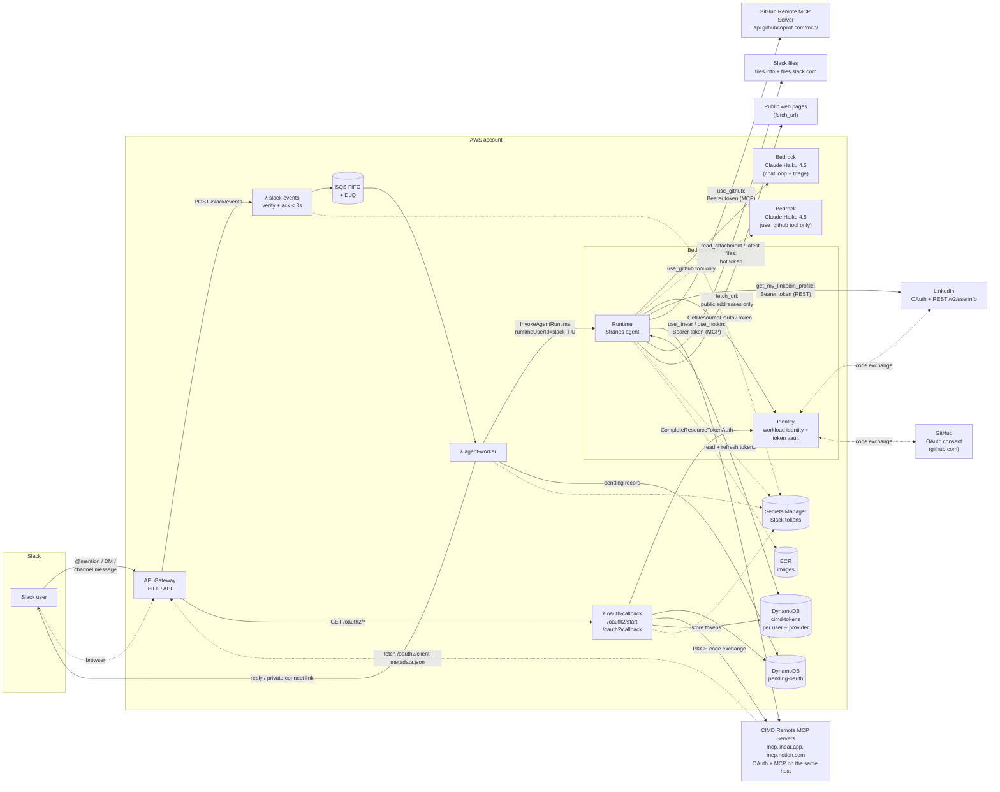
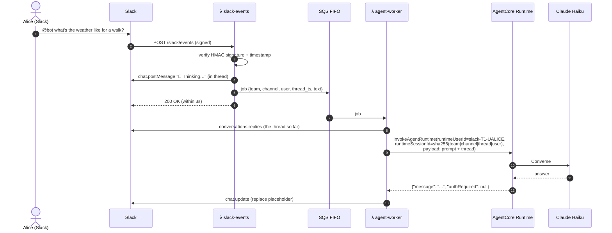
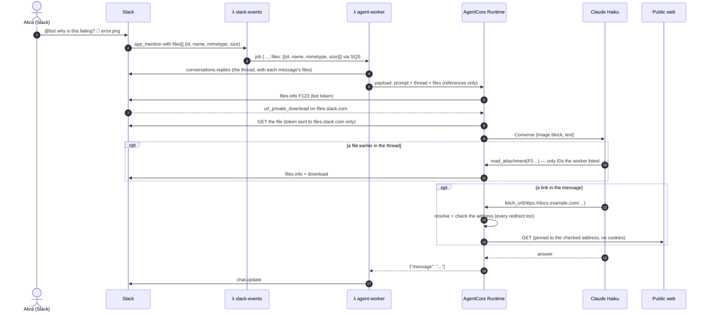
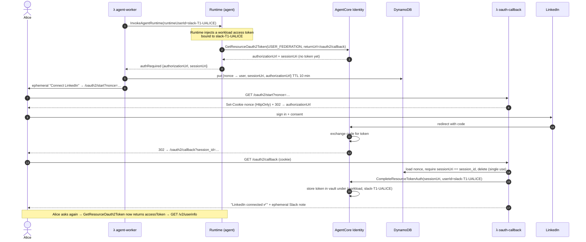
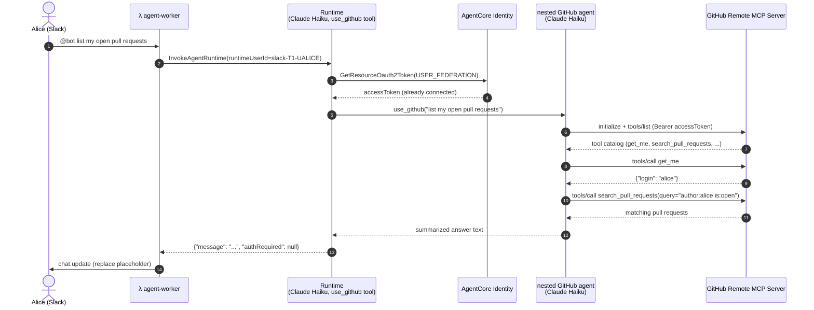
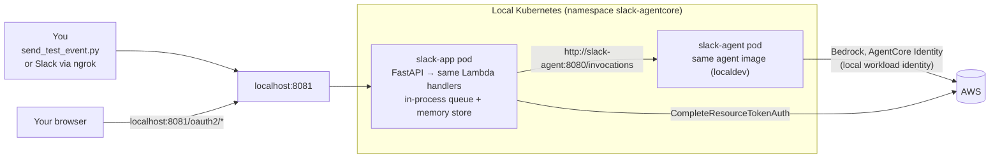

# Architecture

A Slack bot backed by an agent on **Amazon Bedrock AgentCore Runtime** (Strands Agents + Claude Haiku 4.5). The agent reads the Slack thread on every request, which is its only conversation history. It reaches **each Slack user's own LinkedIn and GitHub accounts** through **AgentCore Identity** (OAuth2 authorization code grant) — two independent credential providers, same consent pattern for both. What happens *after* consent differs:

- **LinkedIn** — the agent calls LinkedIn's REST API (`GET /v2/userinfo`) directly with the vaulted token.
- **GitHub** — the agent hands the vaulted token to **GitHub's own public remote MCP server** (`api.githubcopilot.com/mcp/`) and runs a small nested Strands agent (**Claude Haiku 4.5**) against its tool catalog, so it can act on issues, pull requests, repos, and org membership, not just read a profile. See [github-setup.md](github-setup.md).

A third group of services — currently **Linear** and **Notion** — is reached without AgentCore Identity at all, because no AgentCore client authentication method fits their authorization servers. They use **CIMD** (Client ID Metadata Documents, MCP SEP-991): the app publishes a JSON document at `/oauth2/client-metadata.json`, that URL *is* its OAuth `client_id`, and the app performs the PKCE flow itself and keeps the resulting per-user tokens in DynamoDB. Same Slack connect-link experience, different owner of the vault. See [cimd-providers.md](cimd-providers.md).

People can also attach files (screenshots, PDFs, Office documents, CSVs, text and code) and paste links. The agent reads them on demand: files are passed around as Slack file IDs and downloaded only by the agent, and public web pages are fetched by a `fetch_url` tool that refuses internal addresses. See [Request flow: a file or a link](#request-flow-a-file-or-a-link).

It follows the pattern from the AWS blog post [Integrating Amazon Bedrock AgentCore with Slack](https://aws.amazon.com/blogs/machine-learning/integrating-amazon-bedrock-agentcore-with-slack/): an API Gateway webhook, a queue, and an async worker. It adds per-user outbound OAuth on top.

## Components

| Component | Source | Purpose |
|---|---|---|
| `slack-events` Lambda | [backends/lambdas/src/slack_app/handlers/slack_events.py](../backends/lambdas/src/slack_app/handlers/slack_events.py) | Checks the Slack signature, ignores bot messages and retries, and routes the message: @mentions and DMs get "🤔 Thinking…" and are queued; other channel messages, including follow-ups in threads the bot is in, are queued for triage without any visible reaction. See [slack-setup.md](slack-setup.md#replying-without-an-mention). |
| `agent-worker` Lambda | [handlers/agent_worker.py](../backends/lambdas/src/slack_app/handlers/agent_worker.py) | Reads the Slack thread ([thread_history.py](../backends/lambdas/src/slack_app/thread_history.py)). For triage jobs, it then asks Claude Haiku ([triage.py](../backends/lambdas/src/slack_app/triage.py)) to reply, react with 👍, post a correction or ignore the message. To reply, it invokes the Runtime **as the Slack user** with the thread attached, then either posts the answer or sends a private "Connect LinkedIn"/"Connect GitHub" link, depending on which provider the tool needed. |
| `oauth-callback` Lambda | [handlers/oauth_callback.py](../backends/lambdas/src/slack_app/handlers/oauth_callback.py) | Binds the OAuth session to the user's browser and completes consent. Provider-agnostic — reads `pending.provider` for the confirmation page/message, and `pending.cimd` to decide whether AWS finishes the exchange (AgentCore Identity) or we do (CIMD). Also serves the CIMD client metadata document. |
| Agent — LinkedIn tool | [linkedin.py](../backends/agents/slack_agent/src/linkedin.py) | `get_my_linkedin_profile`: fetches the vaulted token, calls LinkedIn's REST API directly, returns JSON. Runs inline in the main `Agent`. |
| Agent — GitHub tool | [github.py](../backends/agents/slack_agent/src/github.py) | `use_github(request)`: fetches the vaulted token, opens an MCP session to GitHub's remote MCP server with it as the Bearer credential, and hands the server's full tool catalog to a **nested** Strands agent (Claude Haiku, `GITHUB_MODEL_ID`) that chains whatever calls the request needs (e.g. `get_me` → `search_repositories`). |
| Agent — CIMD providers | [cimd/](../backends/agents/slack_agent/src/cimd/) | One `use_<key>` tool per entry in [`providers.py`](../backends/agents/slack_agent/src/cimd/providers.py), each wrapping a nested agent like `use_github` does. The package also owns discovery (RFC 9728 → RFC 8414), the PKCE authorization request, token refresh, and the DynamoDB token store. Adding a provider touches only the registry. |
| CIMD client document | [cimd_client.py](../backends/lambdas/src/slack_app/cimd_client.py) | Serves `/oauth2/client-metadata.json` — the app's OAuth `client_id` — and exchanges the authorization code for tokens. No client secret exists anywhere in this path. |
| Agent — attachments | [attachments.py](../backends/agents/slack_agent/src/attachments.py), [slack_files.py](../backends/agents/slack_agent/src/slack_files.py), [content_blocks.py](../backends/agents/slack_agent/src/content_blocks.py) | Opens the files attached to the new message and sends them to the model with the prompt as Converse `image`/`document` blocks. `read_attachment(file_id)` opens a file from earlier in the thread, but only one the worker listed. Downloads use Slack's own `files.info` URL and send the bot token only to `files.slack.com`. |
| Agent — links | [web_fetch.py](../backends/agents/slack_agent/src/web_fetch.py) | `fetch_url(url)`: reads a public page or PDF. Checks every hop against private, loopback, link-local and metadata addresses, connects to the address it checked, and hands GitHub, Linear and Notion links to their own tools instead. |
| Agent — shared state | [auth_state.py](../backends/agents/slack_agent/src/auth_state.py) | `AuthState`: one side-channel both tools write to when consent is needed, read back by `main.py` after the agent loop. |
| GitHub Remote MCP Server | External (owned by GitHub) | Hosted MCP server exposing GitHub's tool catalog (repos, issues, PRs, code search, orgs, ...) over streamable HTTP, authenticated per-request by whatever Bearer token it's given — here, the Slack user's own vaulted OAuth2 token. No AgentCore Gateway involved. |
| Infrastructure | [infra-as-code/tf-app](../infra-as-code/tf-app) | Terraform for everything above, including the IAM allow-list for **both** Bedrock models ([locals.tf](../infra-as-code/tf-app/locals.tf)). |

## Request flow: a normal question

## Request flow: a file or a link

- **The Lambdas never touch file contents.** The event, the SQS job (256 KB limit), triage and the agent payload carry only references. Triage sees `[attached: q3.csv (12 KB)]`, which is enough to judge who a message is for.
- **Files on the new message are opened up front. Earlier files are opened only when needed.** Files further up the thread appear in the prompt as `[attached: architecture-v2.pdf (file F0…)]`, and the model opens one with `read_attachment` when the question needs it. A thread full of screenshots doesn't resend every image on every turn.
- **What the model receives.** Images (PNG, JPEG, GIF, WebP) are scaled down to 1568 px on the long edge, which is the most Claude uses. PDF, DOCX, XLSX, CSV, HTML, Markdown and text files go as documents. Code, JSON and logs go as plain text. Audio, video, archives and files over the limits aren't downloaded, and the reply says why in one line.
- **Converse limits** are enforced per invocation ([content_blocks.py](../backends/agents/slack_agent/src/content_blocks.py)): at most 20 images of 3.75 MB each and 5 documents of 4.5 MB each.

## Request flow: first LinkedIn question (user consent)

Bob asks the same question in the same channel. His request carries `runtimeUserId=slack-T1-UBOB`, so the token vault lookup misses Alice's token, and Bob gets his own consent link. See [identity-and-security.md](identity-and-security.md) for details.

**GitHub's consent flow is identical** — swap `slack-agent-linkedin` for `slack-agent-github` and LinkedIn's authorization/token endpoints for GitHub's. Both providers share the same `/oauth2/start` and `/oauth2/callback` endpoints, the same session-binding logic, and the same DynamoDB `pending-oauth` table; only the provider name travels with the pending record (`PendingAuth.provider`) so the confirmation page and Slack message name the right service. See [github-setup.md](github-setup.md).

**What happens after consent is not identical.** LinkedIn's tool calls `GET /v2/userinfo` directly and returns. GitHub's tool (`use_github`) hands the same vaulted token to GitHub's remote MCP server and delegates to a nested agent that can chain several tool calls before answering:

`use_github` stays a single, lazily-invoked tool from the outer agent's point of view — the outer agent never sees GitHub's dozens of MCP tool schemas, only the one `use_github(request)` tool and its text result. The nested Claude Haiku agent sees the full MCP catalog and decides which of its tools to chain; it is created fresh per call and torn down when the tool returns, so nothing about it is held between Slack messages.

## Request flow: first Linear question (CIMD consent)

Structurally the same as the flows above — private connect link, single-use nonce, cookie
binding, confirmation page — with the OAuth client role moved from AWS to this app:

| | AgentCore Identity (LinkedIn, GitHub) | CIMD (Linear, Notion) |
|---|---|---|
| Who is the OAuth client | AWS | This app |
| Client identifier | Registered client ID + secret | The URL of our client metadata document |
| Client authentication | Client secret in the AgentCore-managed secret | None — PKCE S256 + exact redirect URI |
| Who exchanges the code | `CompleteResourceTokenAuth` | `oauth-callback` Lambda |
| Where tokens live | AgentCore token vault | `cimd-tokens` DynamoDB table (we encrypt and expire it) |
| Adding a provider | Register an app, create a credential provider, deploy | One registry entry + one key in `cimd_providers` |

The full sequence diagram, the document we publish, the table schema and the trust model
are in [cimd-providers.md](cimd-providers.md).

## Local architecture (Tilt)

What changes locally, and why:

| AWS | Local | Reason |
|---|---|---|
| API Gateway + Lambda | FastAPI in the `slack-app` pod ([local_server.py](../backends/lambdas/src/slack_app/local_server.py)) | Same handler code, fast reloads. |
| SQS FIFO | Background thread | No queue emulator needed. |
| DynamoDB pending-oauth | In-memory dict | Single pod. Records are lost on reload. |
| DynamoDB cimd-tokens | The real dev table, or CIMD is off | The agent and the handlers are separate pods, so an in-memory store could not be shared. Empty `CIMD_TOKEN_TABLE` simply unregisters the CIMD tools. |
| Runtime mints the workload token from `runtimeUserId` | Agent calls `GetWorkloadAccessTokenForUserId` on `slack-agent-local` | There is no Runtime locally. |
| Slack Web API | Logged only when `SLACK_DRY_RUN=true` | Lets you work without a Slack workspace. |

## Design choices

- **No AgentCore Gateway.** Per-user OAuth through Gateway needs a per-user *inbound JWT*, which means an IdP login for every Slack user. Calling the Runtime with IAM plus `runtimeUserId` gives the same per-user token isolation with far fewer moving parts. This is why GitHub's OAuth still goes through a second direct AgentCore Identity credential provider (like LinkedIn) rather than a Gateway-fronted target — see [github-setup.md](github-setup.md). [identity-and-security.md](identity-and-security.md) covers when to add Gateway.
- **GitHub's remote MCP server is called directly, not through Gateway.** Gateway is for *hosting* MCP tools behind your own inbound endpoint; here the agent is an outbound MCP *client* of a server GitHub already runs publicly. The only AWS-side piece is the vaulted Bearer token — no Gateway target, no extra infra.
- **The GitHub credential is a GitHub App (user-to-server tokens), not a classic OAuth App.** From AgentCore Identity's point of view the two look identical — same `GithubOauth2` vendor, same authorization-code + session-binding flow — only the app registration and its owning account differ. This matters at GitHub Enterprise Managed Users (EMU) scale: a GitHub App is adopted per organization by installing it (one owner action, EMU-friendly), instead of a classic OAuth App's per-org **OAuth App access restrictions** approval, which some EMU policies block entirely for externally-owned apps. See [github-setup.md](github-setup.md).
- **A nested agent, not a top-level tool list, for GitHub.** The remote MCP server exposes dozens of tools with verbose schemas. Loading them all into the main agent's tool list would cost a token-vault round trip and a schema dump on *every* Slack message, GitHub-related or not. Instead the main agent sees one lazy tool, `use_github(request)`, and only pays that cost — and only spins up the nested agent — when a user actually asks a GitHub question.
- **CIMD instead of AgentCore Identity for Linear and Notion.** Not a preference — a constraint. AgentCore's custom OAuth2 credential providers authenticate with `CLIENT_SECRET_BASIC`/`POST`, `AWS_IAM_ID_TOKEN_JWT` or `PRIVATE_KEY_JWT`; the CIMD draft forbids shared secrets, and these servers advertise only `none` (public client + PKCE), so none of the four fits. The alternative was deprecated Dynamic Client Registration. The cost of going CIMD is owning the token vault; the benefit is that adding the next such server needs no registration, no secret and no infrastructure change. See [cimd-providers.md](cimd-providers.md).
- **One generic CIMD implementation, not one integration per vendor.** Discovery, PKCE, refresh, the token store and the tool wrapper are provider-agnostic; everything vendor-specific lives in a single registry file. Linear and Notion differ only by URL, scopes and a few sentences of prompt guidance.
- **No AgentCore Memory.** Each Runtime session is a dedicated microVM that lives until it idles out (`idle_session_timeout_seconds = 300`, 5 minutes) or hits its hard cap (`max_session_lifetime_seconds = 3600`, 1 hour), whichever comes first — see [agent-runtime.tf](../infra-as-code/tf-app/agent-runtime.tf). Nothing is remembered between requests: the agent-worker reads the Slack thread (`conversations.replies`, first message plus the latest 30) and sends it with every request, so a follow-up after the session has idled out, or from a different person in the thread, has the same context. The thread goes into the prompt as delimited data, so text other people wrote can inform an answer but can't ask for a tool call on the requester's accounts. See [thread_prompt.py](../backends/agents/slack_agent/src/thread_prompt.py).
- **References, not bytes, for files.** Downloading files in the Lambdas would spend the 3-second budget, overflow the 256 KB SQS limit, and send images to triage for nothing. The agent downloads with the bot token it already holds for progress updates, keeps the bytes in memory for one invocation only, and can only open file IDs from the thread the worker read. Nothing is stored, as with the thread itself.
- **One Lambda image, three handlers.** A single build is shared, and `image_config.command` selects the handler. The same code runs locally.
- **Claude Haiku 4.5 throughout, configured per job.** `MODEL_ID` (the chat loop), `TRIAGE_MODEL_ID` (the worker's reply/react/correct/ignore decision), `GITHUB_MODEL_ID` and `CIMD_MODEL_ID` (the nested agents) all default to `us.anthropic.claude-haiku-4-5-20251001-v1:0`. Nova Micro, the lowest-cost model with tool use, used to drive the chat loop. It couldn't reliably weigh a whole thread when deciding whether to ask, answer or stay brief, and it hit `MaxTokensReachedException` chaining GitHub's large tool catalogue. The nested agents also get a larger token budget (4096) than the chat loop (1024). Each can still be set separately. The IAM policies allow-list every configured model's inference-profile and foundation-model ARNs — see [locals.tf](../infra-as-code/tf-app/locals.tf).
