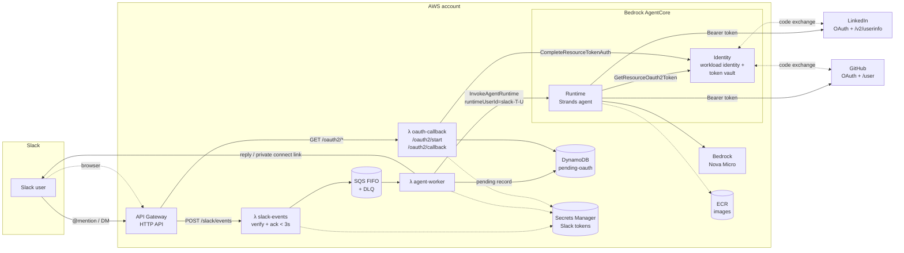
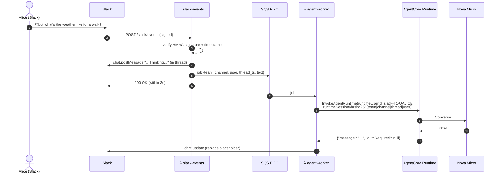
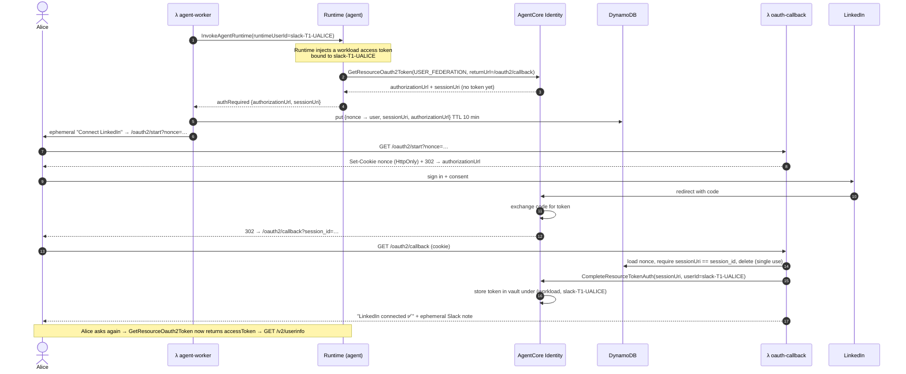
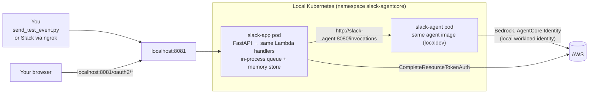

# Architecture

A Slack bot backed by an agent on **Amazon Bedrock AgentCore Runtime** (Strands Agents + Amazon Nova Micro). The agent can read **each Slack user's own LinkedIn and GitHub profile** through **AgentCore Identity** (OAuth2 authorization code grant) — two independent credential providers, same pattern for both.

It follows the pattern from the AWS blog post [Integrating Amazon Bedrock AgentCore with Slack](https://aws.amazon.com/blogs/machine-learning/integrating-amazon-bedrock-agentcore-with-slack/): an API Gateway webhook, a queue, and an async worker. It adds per-user outbound OAuth on top.

## Components

| Component | Source | Purpose |
|---|---|---|
| `slack-events` Lambda | [backends/lambdas/src/slack_app/handlers/slack_events.py](../backends/lambdas/src/slack_app/handlers/slack_events.py) | Checks the Slack signature, ignores bot messages and retries, posts "🤔 Thinking…", and queues the job. |
| `agent-worker` Lambda | [handlers/agent_worker.py](../backends/lambdas/src/slack_app/handlers/agent_worker.py) | Invokes the Runtime **as the Slack user**, then either posts the answer or sends a private "Connect LinkedIn"/"Connect GitHub" link, depending on which provider the tool needed. |
| `oauth-callback` Lambda | [handlers/oauth_callback.py](../backends/lambdas/src/slack_app/handlers/oauth_callback.py) | Binds the OAuth session to the user's browser and completes the token exchange. Provider-agnostic — reads `pending.provider` for the confirmation page/message. |
| Agent | [backends/agents/slack_agent/src](../backends/agents/slack_agent/src) | Strands agent with two tools, `get_my_linkedin_profile` and `get_my_github_profile`, sharing one `AuthState` side-channel ([auth_state.py](../backends/agents/slack_agent/src/auth_state.py)). |
| Infrastructure | [infra-as-code/tf-app](../infra-as-code/tf-app) | Terraform for everything above. |

## Request flow: a normal question

## Request flow: first LinkedIn question (user consent)

Bob asks the same question in the same channel. His request carries `runtimeUserId=slack-T1-UBOB`, so the token vault lookup misses Alice's token, and Bob gets his own consent link. See [identity-and-security.md](identity-and-security.md) for details.

**GitHub follows the identical sequence** — swap `get_my_linkedin_profile` for `get_my_github_profile`, `slack-agent-linkedin` for `slack-agent-github`, and `GET /v2/userinfo` for `GET /user`. Both tools share the same `/oauth2/start` and `/oauth2/callback` endpoints, the same session-binding logic, and the same DynamoDB `pending-oauth` table; only the provider name travels with the pending record (`PendingAuth.provider`) so the confirmation page and Slack message name the right service. See [github-setup.md](github-setup.md).

## Local architecture (Tilt)

What changes locally, and why:

| AWS | Local | Reason |
|---|---|---|
| API Gateway + Lambda | FastAPI in the `slack-app` pod ([local_server.py](../backends/lambdas/src/slack_app/local_server.py)) | Same handler code, fast reloads. |
| SQS FIFO | Background thread | No queue emulator needed. |
| DynamoDB pending-oauth | In-memory dict | Single pod. Records are lost on reload. |
| Runtime mints the workload token from `runtimeUserId` | Agent calls `GetWorkloadAccessTokenForUserId` on `slack-agent-local` | There is no Runtime locally. |
| Slack Web API | Logged only when `SLACK_DRY_RUN=true` | Lets you work without a Slack workspace. |

## Design choices

- **No AgentCore Gateway.** Per-user OAuth through Gateway needs a per-user *inbound JWT*, which means an IdP login for every Slack user. Calling the Runtime with IAM plus `runtimeUserId` gives the same per-user token isolation with far fewer moving parts. This is why GitHub was added as a second direct AgentCore Identity credential provider (like LinkedIn) rather than as a Gateway MCP target — see [github-setup.md](github-setup.md). [identity-and-security.md](identity-and-security.md) covers when to add Gateway.
- **No AgentCore Memory.** Each Runtime session is a dedicated microVM that lives until it idles out (`idle_session_timeout_seconds = 300`, 5 minutes) or hits its hard cap (`max_session_lifetime_seconds = 3600`, 1 hour), whichever comes first — see [agent-runtime.tf](../infra-as-code/tf-app/agent-runtime.tf). An in-process cache keyed by session ID gives multi-turn memory inside a thread. Switch to AgentCore Memory if history must outlive the session.
- **One Lambda image, three handlers.** A single build is shared, and `image_config.command` selects the handler. The same code runs locally.
- **Nova Micro** (`us.amazon.nova-micro-v1:0`) is the lowest-cost Bedrock text model that supports tool use. Change it with `model_id` / `MODEL_ID`.
