# Architecture

A Slack bot backed by an agent on **Amazon Bedrock AgentCore Runtime** (Strands Agents + Claude Haiku 4.5). It reads the Slack thread before every answer, reads the files and links people share, and acts on **each Slack user's own accounts** (LinkedIn, GitHub, Linear, Notion), never a shared one.

It follows the pattern from the AWS blog post [Integrating Amazon Bedrock AgentCore with Slack](https://aws.amazon.com/blogs/machine-learning/integrating-amazon-bedrock-agentcore-with-slack/) (an API Gateway webhook, a queue and an async worker) and adds per-user outbound OAuth on top.

This page zooms in three steps. Read as far as you need:

| Level | Question it answers | Start here if you… |
|---|---|---|
| [1. High level](#level-1--high-level) | What is this and what does it talk to? | are new to the project |
| [2. Mid level](#level-2--mid-level) | Which AWS pieces carry a message, a consent and a tool call? | are about to change a flow |
| [3. Detailed](#level-3--detailed) | Every component, table, API call and message, in order | are debugging or reviewing a change |

## Colour key

Every diagram on this page uses the same colours and arrows.

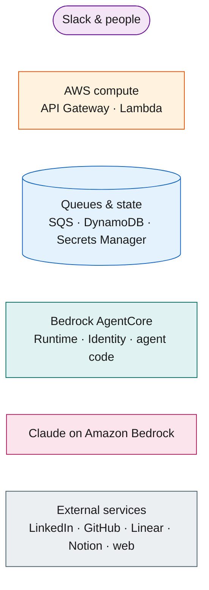
```mermaid
flowchart LR
    K1(["Slack & people"]):::slack
    K2["AWS compute<br/>API Gateway · Lambda"]:::aws
    K3[("Queues & state<br/>SQS · DynamoDB · Secrets Manager")]:::data
    K4["Bedrock AgentCore<br/>Runtime · Identity · agent code"]:::agentcore
    K5["Claude on Amazon Bedrock"]:::model
    K6["External services<br/>LinkedIn · GitHub · Linear · Notion · web"]:::ext

    classDef slack fill:#f3e5f5,stroke:#6a1b9a,color:#1a1a1a
    classDef aws fill:#fff3e0,stroke:#e65100,color:#1a1a1a
    classDef data fill:#e3f2fd,stroke:#1565c0,color:#1a1a1a
    classDef agentcore fill:#e0f2f1,stroke:#00695c,color:#1a1a1a
    classDef model fill:#fce4ec,stroke:#ad1457,color:#1a1a1a
    classDef ext fill:#eceff1,stroke:#455a64,color:#1a1a1a
```

| Arrow | Meaning |
|---|---|
| `══▶` thick | The main path of that diagram |
| `──▶` solid | A supporting call (lookups, progress updates, reads) |
| `┈┈▶` dashed | Consent and OAuth: browser redirects, token exchange, token storage |

Sequence diagrams group participants in boxes of the same colours.

---

## Level 1 — High level

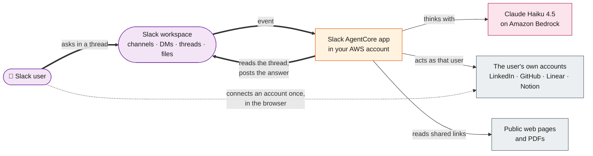
```mermaid
flowchart LR
    U(["👤 Slack user"]):::slack
    SL(["Slack workspace<br/>channels · DMs · threads · files"]):::slack
    APP["Slack AgentCore app<br/>in your AWS account"]:::aws
    LLM["Claude Haiku 4.5<br/>on Amazon Bedrock"]:::model
    ACC["The user's own accounts<br/>LinkedIn · GitHub · Linear · Notion"]:::ext
    WEB["Public web pages<br/>and PDFs"]:::ext

    U == "asks in a thread" ==> SL
    SL == "event" ==> APP
    APP == "reads the thread,<br/>posts the answer" ==> SL
    APP -- "thinks with" --> LLM
    APP -- "acts as that user" --> ACC
    APP -- "reads shared links" --> WEB
    U -. "connects an account once,<br/>in the browser" .-> ACC

    classDef slack fill:#f3e5f5,stroke:#6a1b9a,color:#1a1a1a
    classDef aws fill:#fff3e0,stroke:#e65100,color:#1a1a1a
    classDef model fill:#fce4ec,stroke:#ad1457,color:#1a1a1a
    classDef ext fill:#eceff1,stroke:#455a64,color:#1a1a1a
```

Five ideas explain most of the design:

1. **Slack answers fast, the agent answers later.** Slack needs a reply within 3 seconds, so one Lambda only checks and queues the message. A second Lambda does the slow work.
2. **The Slack thread is the only memory.** Nothing is stored between requests. The thread is read again every time and sent to the agent.
3. **Every request runs as the person who asked.** The agent is invoked with `runtimeUserId=slack-<team>-<user>`, so Alice's tokens are never used for Bob.
4. **Two ways to hold a user's tokens.** AWS holds them for LinkedIn and GitHub (AgentCore Identity). The app holds them for Linear and Notion (CIMD). Users see the same private "Connect" link either way.
5. **Files and links travel as references.** Only the agent downloads a file or fetches a page, and only while answering.

---

## Level 2 — Mid level

Three views of the same system: how a message gets answered, how an account gets connected, and what happens inside the agent.

### 2a. Answering a message

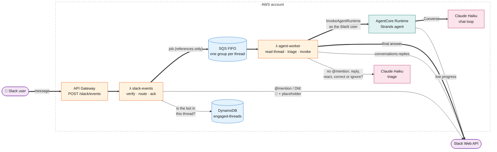
```mermaid
flowchart LR
    U(["👤 Slack user"]):::slack
    SLK(["Slack Web API"]):::slack

    subgraph AWS["AWS account"]
        APIGW["API Gateway<br/>POST /slack/events"]:::aws
        EV["λ slack-events<br/>verify · route · ack"]:::aws
        Q[("SQS FIFO<br/>one group per thread")]:::data
        ENG[("DynamoDB<br/>engaged-threads")]:::data
        WK["λ agent-worker<br/>read thread · triage · invoke"]:::aws
        TRI["Claude Haiku<br/>triage"]:::model
        RT["AgentCore Runtime<br/>Strands agent"]:::agentcore
        LLM["Claude Haiku<br/>chat loop"]:::model
    end

    U == "message" ==> APIGW ==> EV
    EV == "job (references only)" ==> Q ==> WK
    WK == "InvokeAgentRuntime<br/>as the Slack user" ==> RT
    RT == "Converse" ==> LLM
    WK == "final answer" ==> SLK

    EV -- "@mention / DM:<br/>👀 + placeholder" --> SLK
    EV -- "is the bot in<br/>this thread?" --> ENG
    WK -- "conversations.replies" --> SLK
    WK -- "no @mention: reply,<br/>react, correct or ignore?" --> TRI
    RT -- "live progress" --> SLK

    style AWS fill:none,stroke:#9e9e9e,stroke-dasharray:5 5
    classDef slack fill:#f3e5f5,stroke:#6a1b9a,color:#1a1a1a
    classDef aws fill:#fff3e0,stroke:#e65100,color:#1a1a1a
    classDef data fill:#e3f2fd,stroke:#1565c0,color:#1a1a1a
    classDef agentcore fill:#e0f2f1,stroke:#00695c,color:#1a1a1a
    classDef model fill:#fce4ec,stroke:#ad1457,color:#1a1a1a
```

- **Two routes in.** @mentions and DMs are always for the bot, so `slack-events` reacts with 👀 and posts "🤔 Thinking…" straight away. Other channel messages, including follow-ups in threads the bot has joined, are queued silently for **triage**: the worker asks Claude Haiku whether to reply, react with 👍, post a correction, or stay quiet.
- **One FIFO group per thread** keeps messages in a thread in order, while different threads run in parallel.
- **The worker blocks on one call.** The agent posts its own per-tool progress into the placeholder. If nothing has changed after 6 seconds, the worker posts a generic "still working" update.

### 2b. Connecting an account (consent)

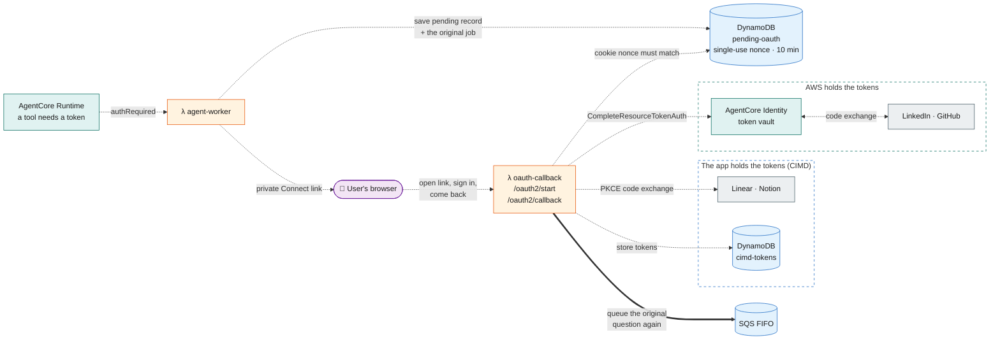
```mermaid
flowchart LR
    RT["AgentCore Runtime<br/>a tool needs a token"]:::agentcore
    WK["λ agent-worker"]:::aws
    PA[("DynamoDB<br/>pending-oauth<br/>single-use nonce · 10 min")]:::data
    B(["👤 User's browser"]):::slack
    CB["λ oauth-callback<br/>/oauth2/start<br/>/oauth2/callback"]:::aws
    Q[("SQS FIFO")]:::data

    subgraph F1["AWS holds the tokens"]
        ID["AgentCore Identity<br/>token vault"]:::agentcore
        LG["LinkedIn · GitHub"]:::ext
    end

    subgraph F2["The app holds the tokens (CIMD)"]
        TOK[("DynamoDB<br/>cimd-tokens")]:::data
        LN["Linear · Notion"]:::ext
    end

    RT -. "authRequired" .-> WK
    WK -. "save pending record<br/>+ the original job" .-> PA
    WK -. "private Connect link" .-> B
    B -. "open link, sign in,<br/>come back" .-> CB
    CB -. "cookie nonce must match" .-> PA
    CB -. "CompleteResourceTokenAuth" .-> ID
    ID <-. "code exchange" .-> LG
    CB -. "PKCE code exchange" .-> LN
    CB -. "store tokens" .-> TOK
    CB == "queue the original<br/>question again" ==> Q

    style F1 fill:none,stroke:#00695c,stroke-dasharray:5 5
    style F2 fill:none,stroke:#1565c0,stroke-dasharray:5 5
    classDef slack fill:#f3e5f5,stroke:#6a1b9a,color:#1a1a1a
    classDef aws fill:#fff3e0,stroke:#e65100,color:#1a1a1a
    classDef data fill:#e3f2fd,stroke:#1565c0,color:#1a1a1a
    classDef agentcore fill:#e0f2f1,stroke:#00695c,color:#1a1a1a
    classDef ext fill:#eceff1,stroke:#455a64,color:#1a1a1a
```

- **The same flow for every provider** up to the callback: a private link, a single-use nonce in an HttpOnly cookie, and one callback endpoint. The pending record says which kind of provider it was for.
- **After the callback, the two differ.** For LinkedIn and GitHub, AWS has already exchanged the code, and the callback only confirms the session belongs to this user. For Linear and Notion, the app is the OAuth client, so the callback runs the PKCE exchange and stores the tokens itself.
- **Users don't have to ask twice.** The original job was saved with the link, so the callback puts it back on the queue and the answer replaces the "I need access" message.

### 2c. Inside the agent

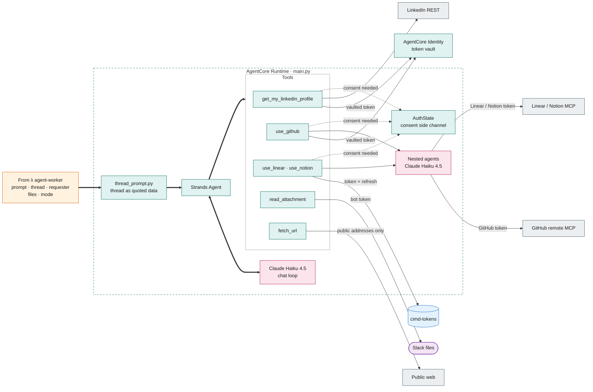
```mermaid
flowchart LR
    IN["From λ agent-worker<br/>prompt · thread · requester<br/>files · mode"]:::aws

    subgraph RT["AgentCore Runtime · main.py"]
        PR["thread_prompt.py<br/>thread as quoted data"]:::agentcore
        AG["Strands Agent"]:::agentcore
        LLM["Claude Haiku 4.5<br/>chat loop"]:::model
        AS["AuthState<br/>consent side channel"]:::agentcore

        subgraph TOOLS["Tools"]
            T1["get_my_linkedin_profile"]:::agentcore
            T2["use_github"]:::agentcore
            T3["use_linear · use_notion"]:::agentcore
            T4["read_attachment"]:::agentcore
            T5["fetch_url"]:::agentcore
        end

        NA["Nested agents<br/>Claude Haiku 4.5"]:::model
    end

    ID["AgentCore Identity<br/>token vault"]:::agentcore
    TOK[("cimd-tokens")]:::data
    LI["LinkedIn REST"]:::ext
    GHM["GitHub remote MCP"]:::ext
    CM["Linear / Notion MCP"]:::ext
    SF(["Slack files"]):::slack
    WEB["Public web"]:::ext

    IN ==> PR ==> AG
    AG <==> LLM
    AG ==> TOOLS
    T1 & T2 -- "vaulted token" --> ID
    T3 -- "token + refresh" --> TOK
    T1 --> LI
    T2 --> NA
    T3 --> NA
    NA -- "GitHub token" --> GHM
    NA -- "Linear / Notion token" --> CM
    T4 -- "bot token" --> SF
    T5 -- "public addresses only" --> WEB
    T1 & T2 & T3 -. "consent needed" .-> AS

    style RT fill:none,stroke:#00695c,stroke-dasharray:5 5
    style TOOLS fill:none,stroke:#9e9e9e
    classDef slack fill:#f3e5f5,stroke:#6a1b9a,color:#1a1a1a
    classDef aws fill:#fff3e0,stroke:#e65100,color:#1a1a1a
    classDef data fill:#e3f2fd,stroke:#1565c0,color:#1a1a1a
    classDef agentcore fill:#e0f2f1,stroke:#00695c,color:#1a1a1a
    classDef model fill:#fce4ec,stroke:#ad1457,color:#1a1a1a
    classDef ext fill:#eceff1,stroke:#455a64,color:#1a1a1a
```

- **One lazy tool per service.** GitHub, Linear and Notion each expose dozens of MCP tools. The main agent sees one `use_<service>(request)` tool, and a short-lived nested agent works through that service's tool catalogue only when someone asks about it.
- **AuthState** is how any tool says "this user must connect first". `main.py` reads it after the agent loop and returns `authRequired` to the worker.
- **Correct mode** (from triage) builds an agent with **no tools**. It can only point back to something the bot itself posted earlier in the thread.

---

## Level 3 — Detailed

### All components

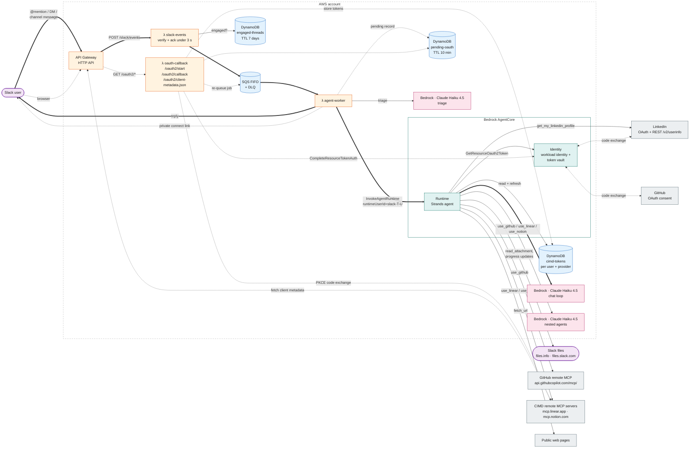
```mermaid
flowchart LR
    U(["Slack user"]):::slack
    SF(["Slack files<br/>files.info · files.slack.com"]):::slack

    subgraph AWS["AWS account"]
        APIGW["API Gateway<br/>HTTP API"]:::aws
        EV["λ slack-events<br/>verify + ack under 3 s"]:::aws
        Q[("SQS FIFO<br/>+ DLQ")]:::data
        WK["λ agent-worker"]:::aws
        CB["λ oauth-callback<br/>/oauth2/start<br/>/oauth2/callback<br/>/oauth2/client-metadata.json"]:::aws
        ENG[("DynamoDB<br/>engaged-threads<br/>TTL 7 days")]:::data
        PA[("DynamoDB<br/>pending-oauth<br/>TTL 10 min")]:::data
        TOK[("DynamoDB<br/>cimd-tokens<br/>per user + provider")]:::data

        subgraph AC["Bedrock AgentCore"]
            RT["Runtime<br/>Strands agent"]:::agentcore
            ID["Identity<br/>workload identity +<br/>token vault"]:::agentcore
        end

        BRT["Bedrock · Claude Haiku 4.5<br/>triage"]:::model
        BR["Bedrock · Claude Haiku 4.5<br/>chat loop"]:::model
        BR2["Bedrock · Claude Haiku 4.5<br/>nested agents"]:::model
    end

    LI["LinkedIn<br/>OAuth + REST /v2/userinfo"]:::ext
    GH["GitHub<br/>OAuth consent"]:::ext
    GHMCP["GitHub remote MCP<br/>api.githubcopilot.com/mcp/"]:::ext
    CIMD["CIMD remote MCP servers<br/>mcp.linear.app · mcp.notion.com"]:::ext
    WEB["Public web pages"]:::ext

    U == "@mention / DM /<br/>channel message" ==> APIGW
    APIGW == "POST /slack/events" ==> EV
    EV ==> Q ==> WK
    WK == "InvokeAgentRuntime<br/>runtimeUserId=slack-T-U" ==> RT
    RT ==> BR
    WK == "reply" ==> U

    EV -- "engaged?" --> ENG
    WK -- "triage" --> BRT
    RT -- "use_github / use_linear / use_notion" --> BR2
    RT -- "GetResourceOauth2Token" --> ID
    RT -- "get_my_linkedin_profile" --> LI
    RT -- "use_github" --> GHMCP
    RT -- "use_linear / use_notion" --> CIMD
    RT -- "read + refresh" --> TOK
    RT -- "read_attachment,<br/>progress updates" --> SF
    RT -- "fetch_url" --> WEB

    WK -. "pending record" .-> PA
    WK -. "private connect link" .-> U
    U -. "browser" .-> APIGW
    APIGW -. "GET /oauth2/*" .-> CB
    CB -.-> PA
    CB -. "CompleteResourceTokenAuth" .-> ID
    CB -. "PKCE code exchange" .-> CIMD
    CB -. "store tokens" .-> TOK
    CB -. "re-queue job" .-> Q
    CIMD -. "fetch client metadata" .-> APIGW
    ID <-. "code exchange" .-> LI
    ID <-. "code exchange" .-> GH

    style AWS fill:none,stroke:#9e9e9e,stroke-dasharray:5 5
    style AC fill:none,stroke:#00695c
    classDef slack fill:#f3e5f5,stroke:#6a1b9a,color:#1a1a1a
    classDef aws fill:#fff3e0,stroke:#e65100,color:#1a1a1a
    classDef data fill:#e3f2fd,stroke:#1565c0,color:#1a1a1a
    classDef agentcore fill:#e0f2f1,stroke:#00695c,color:#1a1a1a
    classDef model fill:#fce4ec,stroke:#ad1457,color:#1a1a1a
    classDef ext fill:#eceff1,stroke:#455a64,color:#1a1a1a
```

Not drawn, because everything uses them: **Secrets Manager** holds the Slack bot token and signing secret, read by all three Lambdas and the agent. **ECR** holds the Lambda and agent images.

| Component | Source | Purpose |
|---|---|---|
| `slack-events` Lambda | [handlers/slack_events.py](../backends/lambdas/src/slack_app/handlers/slack_events.py) | Checks the Slack signature, ignores bot messages and retries, and routes the message. @mentions and DMs get 👀 and "🤔 Thinking…" and are queued. Other channel messages, including follow-ups in threads the bot is in, are queued for triage with no visible reaction. See [slack-setup.md](slack-setup.md#replying-without-an-mention). |
| `agent-worker` Lambda | [handlers/agent_worker.py](../backends/lambdas/src/slack_app/handlers/agent_worker.py) | Reads the Slack thread ([thread_history.py](../backends/lambdas/src/slack_app/thread_history.py)). For triage jobs, asks Claude Haiku ([triage.py](../backends/lambdas/src/slack_app/triage.py)) to reply, react, correct or ignore. To reply, it invokes the Runtime **as the Slack user** with the thread attached, then posts the answer or a private "Connect …" link and swaps the reaction for the outcome (💬, 🔒 or ⚠️). |
| `oauth-callback` Lambda | [handlers/oauth_callback.py](../backends/lambdas/src/slack_app/handlers/oauth_callback.py) | Binds the OAuth session to the user's browser and completes consent. `pending.cimd` decides whether AWS finishes the exchange (AgentCore Identity) or this Lambda does (CIMD). Re-queues the original question, and serves the CIMD client metadata document. |
| `engaged-threads` table | [engaged_threads.py](../backends/lambdas/src/slack_app/engaged_threads.py) | Threads the bot has posted in, so follow-ups there are triaged towards a reply. Expires after 7 days of silence from the bot. |
| `pending-oauth` table | [pending_auth.py](../backends/lambdas/src/slack_app/pending_auth.py) | One record per Connect link: nonce, Slack user, provider, session or CIMD handoff, and the job to resume. Single use, 10-minute TTL. |
| Agent entry point | [main.py](../backends/agents/slack_agent/src/main.py) | Builds the prompt from the thread ([thread_prompt.py](../backends/agents/slack_agent/src/thread_prompt.py)), wires the tools, and posts live per-tool progress ([slack_progress.py](../backends/agents/slack_agent/src/slack_progress.py)). |
| Agent — LinkedIn tool | [linkedin.py](../backends/agents/slack_agent/src/linkedin.py) | `get_my_linkedin_profile`: fetches the vaulted token, calls LinkedIn's REST API directly and returns JSON. |
| Agent — GitHub tool | [github.py](../backends/agents/slack_agent/src/github.py) | `use_github(request)`: fetches the vaulted token, opens an MCP session to GitHub's remote MCP server with it, and hands the tool catalogue to a **nested** Strands agent (`GITHUB_MODEL_ID`) that chains the calls the request needs (e.g. `get_me` → `search_repositories`). See [github-setup.md](github-setup.md). |
| Agent — CIMD providers | [cimd/](../backends/agents/slack_agent/src/cimd/) | One `use_<key>` tool per entry in [providers.py](../backends/agents/slack_agent/src/cimd/providers.py), each wrapping a nested agent. Also owns discovery (RFC 9728 → RFC 8414), the PKCE request, token refresh and the DynamoDB token store. Adding a provider touches only the registry. See [cimd-providers.md](cimd-providers.md). |
| CIMD client document | [cimd_client.py](../backends/lambdas/src/slack_app/cimd_client.py) | Serves `/oauth2/client-metadata.json` (the app's OAuth `client_id`) and exchanges the authorization code for tokens. No client secret exists anywhere in this path. |
| Agent — attachments | [attachments.py](../backends/agents/slack_agent/src/attachments.py), [slack_files.py](../backends/agents/slack_agent/src/slack_files.py), [content_blocks.py](../backends/agents/slack_agent/src/content_blocks.py) | Opens files on the new message and sends them as Converse `image`/`document` blocks. `read_attachment(file_id)` opens an earlier file, but only one the worker listed. The bot token is sent only to `files.slack.com`. |
| Agent — links | [web_fetch.py](../backends/agents/slack_agent/src/web_fetch.py) | `fetch_url(url)`: reads a public page or PDF. Checks every hop against private, loopback, link-local and metadata addresses, and hands GitHub, Linear and Notion links to their own tools. |
| Agent — shared state | [auth_state.py](../backends/agents/slack_agent/src/auth_state.py) | `AuthState`: the side channel every tool writes to when consent is needed. |
| GitHub remote MCP server | External (owned by GitHub) | GitHub's hosted MCP server, authenticated per request by the user's own vaulted token. No AgentCore Gateway involved. |
| Infrastructure | [infra-as-code/tf-app](../infra-as-code/tf-app) | Terraform for all of the above, including the IAM allow-list for every configured model ([locals.tf](../infra-as-code/tf-app/locals.tf)). |

### Sequence: an @mention or DM

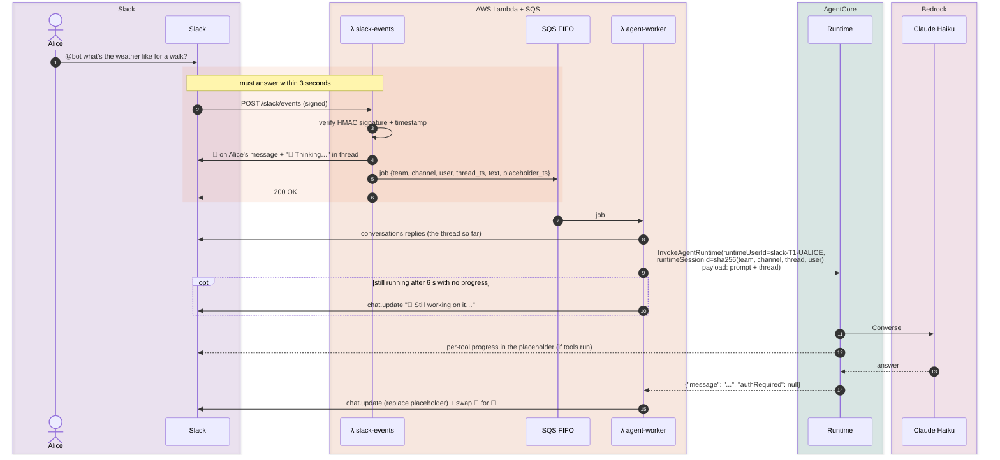
```mermaid
sequenceDiagram
    autonumber
    box rgba(106,27,154,0.10) Slack
        actor A as Alice
        participant S as Slack
    end
    box rgba(230,81,0,0.10) AWS Lambda + SQS
        participant E as λ slack-events
        participant Q as SQS FIFO
        participant W as λ agent-worker
    end
    box rgba(0,105,92,0.12) AgentCore
        participant R as Runtime
    end
    box rgba(173,20,87,0.10) Bedrock
        participant M as Claude Haiku
    end

    A->>S: @bot what's the weather like for a walk?
    rect rgba(230,81,0,0.08)
        Note over S,E: must answer within 3 seconds
        S->>E: POST /slack/events (signed)
        E->>E: verify HMAC signature + timestamp
        E->>S: 👀 on Alice's message + "🤔 Thinking…" in thread
        E->>Q: job {team, channel, user, thread_ts, text, placeholder_ts}
        E-->>S: 200 OK
    end
    Q->>W: job
    W->>S: conversations.replies (the thread so far)
    W->>R: InvokeAgentRuntime(runtimeUserId=slack-T1-UALICE,<br/>runtimeSessionId=sha256(team, channel, thread, user),<br/>payload: prompt + thread)
    opt still running after 6 s with no progress
        W->>S: chat.update "🔎 Still working on it…"
    end
    R->>M: Converse
    R-->>S: per-tool progress in the placeholder (if tools run)
    M-->>R: answer
    R-->>W: {"message": "...", "authRequired": null}
    W->>S: chat.update (replace placeholder) + swap 👀 for 💬
```

### Sequence: a channel message without an @mention (triage)

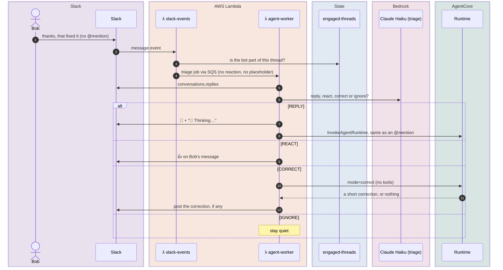
```mermaid
sequenceDiagram
    autonumber
    box rgba(106,27,154,0.10) Slack
        actor B as Bob
        participant S as Slack
    end
    box rgba(230,81,0,0.10) AWS Lambda
        participant E as λ slack-events
        participant W as λ agent-worker
    end
    box rgba(21,101,192,0.10) State
        participant D as engaged-threads
    end
    box rgba(173,20,87,0.10) Bedrock
        participant T as Claude Haiku (triage)
    end
    box rgba(0,105,92,0.12) AgentCore
        participant R as Runtime
    end

    B->>S: thanks, that fixed it (no @mention)
    S->>E: message event
    E->>D: is the bot part of this thread?
    E->>W: triage job via SQS (no reaction, no placeholder)
    W->>S: conversations.replies
    W->>T: reply, react, correct or ignore?
    alt REPLY
        W->>S: 👀 + "🤔 Thinking…"
        W->>R: InvokeAgentRuntime, same as an @mention
    else REACT
        W->>S: 👍 on Bob's message
    else CORRECT
        W->>R: mode=correct (no tools)
        R-->>W: a short correction, or nothing
        W->>S: post the correction, if any
    else IGNORE
        Note over W: stay quiet
    end
```

### Sequence: a file or a link

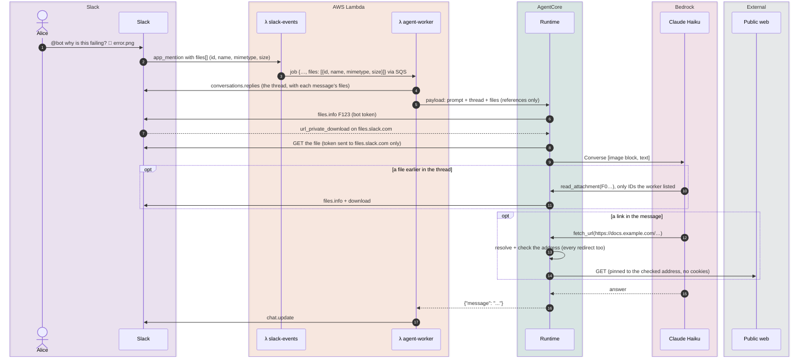
```mermaid
sequenceDiagram
    autonumber
    box rgba(106,27,154,0.10) Slack
        actor A as Alice
        participant S as Slack
    end
    box rgba(230,81,0,0.10) AWS Lambda
        participant E as λ slack-events
        participant W as λ agent-worker
    end
    box rgba(0,105,92,0.12) AgentCore
        participant R as Runtime
    end
    box rgba(173,20,87,0.10) Bedrock
        participant M as Claude Haiku
    end
    box rgba(69,90,100,0.10) External
        participant P as Public web
    end

    A->>S: @bot why is this failing? 📎 error.png
    S->>E: app_mention with files[] (id, name, mimetype, size)
    E->>W: job {…, files: [{id, name, mimetype, size}]} via SQS
    W->>S: conversations.replies (the thread, with each message's files)
    W->>R: payload: prompt + thread + files (references only)
    R->>S: files.info F123 (bot token)
    S-->>R: url_private_download on files.slack.com
    R->>S: GET the file (token sent to files.slack.com only)
    R->>M: Converse [image block, text]
    opt a file earlier in the thread
        M->>R: read_attachment(F0…), only IDs the worker listed
        R->>S: files.info + download
    end
    opt a link in the message
        M->>R: fetch_url(https://docs.example.com/…)
        R->>R: resolve + check the address (every redirect too)
        R->>P: GET (pinned to the checked address, no cookies)
    end
    M-->>R: answer
    R-->>W: {"message": "..."}
    W->>S: chat.update
```

- **The Lambdas never touch file contents.** The event, the SQS job (256 KB limit), triage and the agent payload carry only references. Triage sees `[attached: q3.csv (12 KB)]`, which is enough to judge who a message is for.
- **Files on the new message are opened up front. Earlier files are opened only when needed.** They appear in the prompt as `[attached: architecture-v2.pdf (file F0…)]`, and the model opens one with `read_attachment` when the question needs it.
- **What the model receives.** Images (PNG, JPEG, GIF, WebP) are scaled to 1568 px on the long edge. PDF, DOCX, XLSX, CSV, HTML, Markdown and text go as documents. Code, JSON and logs go as plain text. Audio, video, archives and oversized files aren't downloaded, and the reply says why in one line.
- **Converse limits** per invocation ([content_blocks.py](../backends/agents/slack_agent/src/content_blocks.py)): at most 20 images of 3.75 MB and 5 documents of 4.5 MB.

### Sequence: first LinkedIn question (AgentCore Identity consent)

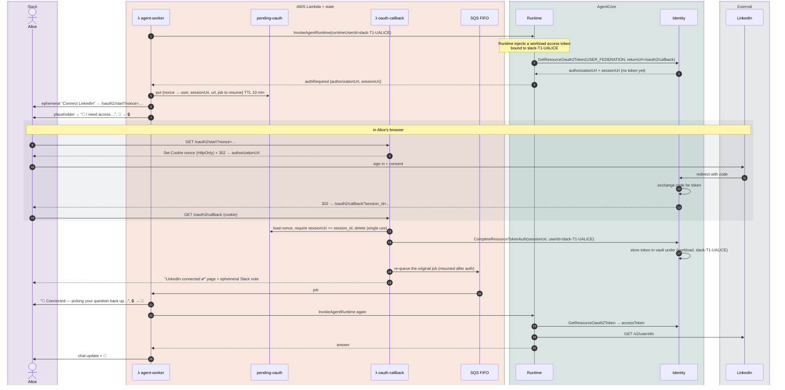
```mermaid
sequenceDiagram
    autonumber
    box rgba(106,27,154,0.10) Slack
        actor A as Alice
    end
    box rgba(230,81,0,0.10) AWS Lambda + state
        participant W as λ agent-worker
        participant D as pending-oauth
        participant C as λ oauth-callback
        participant Q as SQS FIFO
    end
    box rgba(0,105,92,0.12) AgentCore
        participant R as Runtime
        participant I as Identity
    end
    box rgba(69,90,100,0.10) External
        participant L as LinkedIn
    end

    W->>R: InvokeAgentRuntime(runtimeUserId=slack-T1-UALICE)
    Note over R: Runtime injects a workload access token<br/>bound to slack-T1-UALICE
    R->>I: GetResourceOauth2Token(USER_FEDERATION, returnUrl=/oauth2/callback)
    I-->>R: authorizationUrl + sessionUri (no token yet)
    R-->>W: authRequired {authorizationUrl, sessionUri}
    W->>D: put {nonce → user, sessionUri, url, job to resume} TTL 10 min
    W->>A: ephemeral "Connect LinkedIn" → /oauth2/start?nonce=…
    W->>A: placeholder → "🔐 I need access…", 👀 → 🔒
    rect rgba(69,90,100,0.08)
        Note over A,L: in Alice's browser
        A->>C: GET /oauth2/start?nonce=…
        C-->>A: Set-Cookie nonce (HttpOnly) + 302 → authorizationUrl
        A->>L: sign in + consent
        L->>I: redirect with code
        I->>I: exchange code for token
        I-->>A: 302 → /oauth2/callback?session_id=…
        A->>C: GET /oauth2/callback (cookie)
    end
    C->>D: load nonce, require sessionUri == session_id, delete (single use)
    C->>I: CompleteResourceTokenAuth(sessionUri, userId=slack-T1-UALICE)
    I->>I: store token in vault under (workload, slack-T1-UALICE)
    C->>Q: re-queue the original job (resumed after auth)
    C-->>A: "LinkedIn connected ✅" page + ephemeral Slack note
    Q->>W: job
    W->>A: "🔄 Connected — picking your question back up…", 🔒 → 👀
    W->>R: InvokeAgentRuntime again
    R->>I: GetResourceOauth2Token → accessToken
    R->>L: GET /v2/userinfo
    R-->>W: answer
    W->>A: chat.update + 💬
```

Bob asks the same question in the same channel. His request carries `runtimeUserId=slack-T1-UBOB`, so the vault lookup misses Alice's token and Bob gets his own Connect link. See [identity-and-security.md](identity-and-security.md).

**GitHub's consent flow is identical.** Swap `slack-agent-linkedin` for `slack-agent-github` and LinkedIn's endpoints for GitHub's. Both share `/oauth2/start`, `/oauth2/callback`, the session-binding logic and the `pending-oauth` table. Only `PendingAuth.provider` changes, so the confirmation page and Slack message name the right service. See [github-setup.md](github-setup.md).

### Sequence: a GitHub question once connected

What happens after consent is not the same. LinkedIn's tool calls `GET /v2/userinfo` and returns. `use_github` hands the same kind of vaulted token to GitHub's remote MCP server and lets a nested agent chain several calls:

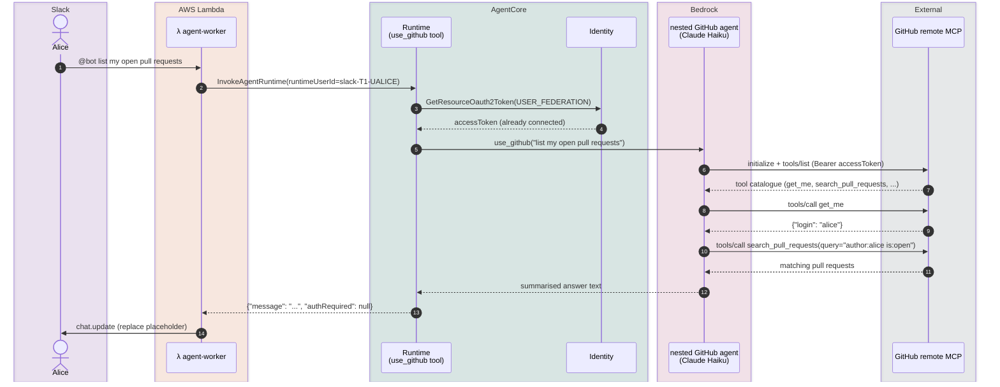
```mermaid
sequenceDiagram
    autonumber
    box rgba(106,27,154,0.10) Slack
        actor A as Alice
    end
    box rgba(230,81,0,0.10) AWS Lambda
        participant W as λ agent-worker
    end
    box rgba(0,105,92,0.12) AgentCore
        participant R as Runtime<br/>(use_github tool)
        participant I as Identity
    end
    box rgba(173,20,87,0.10) Bedrock
        participant G as nested GitHub agent<br/>(Claude Haiku)
    end
    box rgba(69,90,100,0.10) External
        participant MCP as GitHub remote MCP
    end

    A->>W: @bot list my open pull requests
    W->>R: InvokeAgentRuntime(runtimeUserId=slack-T1-UALICE)
    R->>I: GetResourceOauth2Token(USER_FEDERATION)
    I-->>R: accessToken (already connected)
    R->>G: use_github("list my open pull requests")
    G->>MCP: initialize + tools/list (Bearer accessToken)
    MCP-->>G: tool catalogue (get_me, search_pull_requests, ...)
    G->>MCP: tools/call get_me
    MCP-->>G: {"login": "alice"}
    G->>MCP: tools/call search_pull_requests(query="author:alice is:open")
    MCP-->>G: matching pull requests
    G-->>R: summarised answer text
    R-->>W: {"message": "...", "authRequired": null}
    W->>A: chat.update (replace placeholder)
```

The outer agent never sees GitHub's MCP tool schemas, only `use_github(request)` and its text result. The nested agent is created per call and discarded when the tool returns, so nothing about it is kept between Slack messages.

### Consent: AgentCore Identity vs CIMD

Linear and Notion follow the same Slack-side steps (private link, single-use nonce, cookie binding, confirmation page, resume) with the OAuth client role moved from AWS to this app:

| | AgentCore Identity (LinkedIn, GitHub) | CIMD (Linear, Notion) |
|---|---|---|
| Who is the OAuth client | AWS | This app |
| Client identifier | Registered client ID + secret | The URL of our client metadata document |
| Client authentication | Client secret in the AgentCore-managed secret | None: PKCE S256 + exact redirect URI |
| Who exchanges the code | `CompleteResourceTokenAuth` | `oauth-callback` Lambda |
| Where tokens live | AgentCore token vault | `cimd-tokens` DynamoDB table (we encrypt and expire it) |
| Adding a provider | Register an app, create a credential provider, deploy | One registry entry + one key in `cimd_providers` |

The full CIMD sequence, the document we publish, the table schema and the trust model are in [cimd-providers.md](cimd-providers.md).

---

## Local architecture (Tilt)

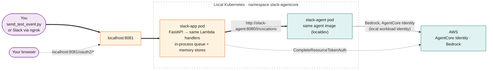
```mermaid
flowchart LR
    DEV(["You<br/>send_test_event.py<br/>or Slack via ngrok"]):::slack
    BRW(["Your browser"]):::slack
    PF1["localhost:8081"]:::aws

    subgraph K8S["Local Kubernetes · namespace slack-agentcore"]
        APP["slack-app pod<br/>FastAPI → same Lambda handlers<br/>in-process queue + memory stores"]:::aws
        AG["slack-agent pod<br/>same agent image (localdev)"]:::agentcore
    end

    AWS["AWS<br/>AgentCore Identity · Bedrock"]:::agentcore

    DEV ==> PF1 ==> APP
    APP == "http://slack-agent:8080/invocations" ==> AG
    AG -- "Bedrock, AgentCore Identity<br/>(local workload identity)" --> AWS
    BRW -. "localhost:8081/oauth2/*" .-> PF1
    APP -. "CompleteResourceTokenAuth" .-> AWS

    style K8S fill:none,stroke:#9e9e9e,stroke-dasharray:5 5
    classDef slack fill:#f3e5f5,stroke:#6a1b9a,color:#1a1a1a
    classDef aws fill:#fff3e0,stroke:#e65100,color:#1a1a1a
    classDef agentcore fill:#e0f2f1,stroke:#00695c,color:#1a1a1a
```

| AWS | Local | Reason |
|---|---|---|
| API Gateway + Lambda | FastAPI in the `slack-app` pod ([local_server.py](../backends/lambdas/src/slack_app/local_server.py)) | Same handler code, fast reloads. |
| SQS FIFO | Background thread | No queue emulator needed. |
| DynamoDB pending-oauth, engaged-threads | In-memory dicts | Single pod. Records are lost on reload. |
| DynamoDB cimd-tokens | The real dev table, or CIMD is off | The agent and the handlers are separate pods, so an in-memory store could not be shared. Empty `CIMD_TOKEN_TABLE` unregisters the CIMD tools. |
| Runtime mints the workload token from `runtimeUserId` | Agent calls `GetWorkloadAccessTokenForUserId` on `slack-agent-local` | There is no Runtime locally. |
| Slack Web API | Logged only when `SLACK_DRY_RUN=true` | Lets you work without a Slack workspace. |

## Design choices

- **No AgentCore Gateway.** Per-user OAuth through Gateway needs a per-user *inbound JWT*, which means an IdP login for every Slack user. Calling the Runtime with IAM plus `runtimeUserId` gives the same per-user token isolation with far fewer moving parts. This is why GitHub's OAuth goes through a second AgentCore Identity credential provider (like LinkedIn) rather than a Gateway target. [identity-and-security.md](identity-and-security.md) covers when to add Gateway.
- **GitHub's remote MCP server is called directly, not through Gateway.** Gateway is for *hosting* MCP tools behind your own inbound endpoint. Here the agent is an outbound MCP *client* of a server GitHub already runs. The only AWS-side piece is the vaulted Bearer token.
- **The GitHub credential is a GitHub App (user-to-server tokens), not a classic OAuth App.** To AgentCore Identity the two look identical: same `GithubOauth2` vendor, same flow. It matters for GitHub Enterprise Managed Users (EMU): a GitHub App is adopted per organization by installing it, instead of the per-org OAuth App access approval that some EMU policies block for external apps. See [github-setup.md](github-setup.md).
- **A nested agent, not a top-level tool list, for GitHub.** Loading dozens of verbose MCP schemas into the main agent would cost a token-vault round trip and a schema dump on *every* Slack message. The main agent sees one lazy tool, `use_github(request)`, and only pays that cost when someone asks a GitHub question.
- **CIMD instead of AgentCore Identity for Linear and Notion.** A constraint, not a preference. AgentCore's custom OAuth2 credential providers authenticate with `CLIENT_SECRET_BASIC`/`POST`, `AWS_IAM_ID_TOKEN_JWT` or `PRIVATE_KEY_JWT`. The CIMD draft forbids shared secrets, and these servers advertise only `none` (public client + PKCE), so none of the four fits. The alternative was deprecated Dynamic Client Registration. The cost is owning the token vault. The benefit is that the next such server needs no registration, no secret and no infrastructure change. See [cimd-providers.md](cimd-providers.md).
- **One generic CIMD implementation, not one integration per vendor.** Discovery, PKCE, refresh, the token store and the tool wrapper are provider-agnostic. Everything vendor-specific lives in one registry file.
- **No AgentCore Memory.** Each Runtime session is a microVM that lives until it idles out (`idle_session_timeout_seconds = 300`) or hits its cap (`max_session_lifetime_seconds = 3600`), see [agent-runtime.tf](../infra-as-code/tf-app/agent-runtime.tf). Nothing is remembered between requests: the worker reads the Slack thread (first message plus the latest 30) and sends it every time, so a follow-up after the session idles out, or from someone else in the thread, has the same context. The thread goes into the prompt as delimited data, so other people's text can inform an answer but can't trigger a tool call on the requester's accounts. See [thread_prompt.py](../backends/agents/slack_agent/src/thread_prompt.py).
- **References, not bytes, for files.** Downloading in the Lambdas would spend the 3-second budget, overflow the 256 KB SQS limit, and send images to triage for nothing. The agent downloads with the bot token it already holds for progress updates, keeps the bytes in memory for one invocation, and can only open file IDs from the thread the worker read.
- **One Lambda image, three handlers.** A single build is shared, and `image_config.command` selects the handler. The same code runs locally.
- **Claude Haiku 4.5 throughout, configured per job.** `MODEL_ID` (chat loop), `TRIAGE_MODEL_ID` (the worker's reply/react/correct/ignore decision), `GITHUB_MODEL_ID` and `CIMD_MODEL_ID` (nested agents) all default to `us.anthropic.claude-haiku-4-5-20251001-v1:0`. Nova Micro used to drive the chat loop, but it couldn't reliably weigh a whole thread and hit `MaxTokensReachedException` chaining GitHub's large tool catalogue. Nested agents get 4096 output tokens, the chat loop 1024. The IAM policies allow-list every configured model's inference-profile and foundation-model ARNs, see [locals.tf](../infra-as-code/tf-app/locals.tf).
