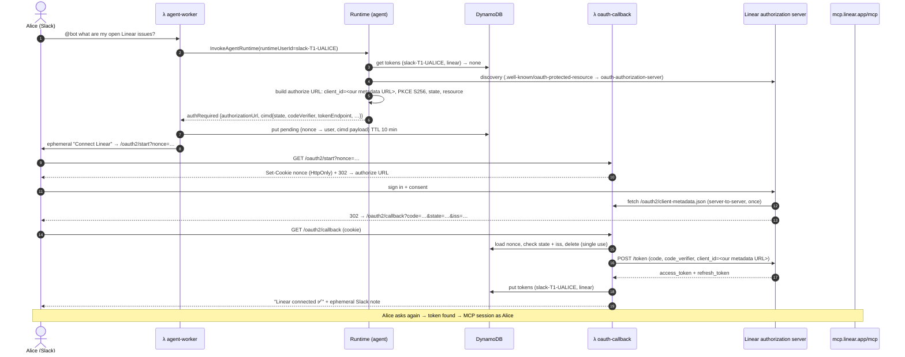

# CIMD Remote MCP Servers (Linear, Notion, …)

This app reaches third-party services in two different ways. LinkedIn and GitHub go
through **AgentCore Identity**: AWS is the OAuth client, holds a client secret, and owns
the token vault. Linear and Notion go through **CIMD**, where *we* are the OAuth client
and identify ourselves with a URL instead of a registration.

Adding a CIMD provider takes one entry in
[`cimd/providers.py`](../backends/agents/slack_agent/src/cimd/providers.py) and one key in
`cimd_providers`. No developer account, no client ID, no client secret, no credential
provider, no Lambda change.

## What CIMD is

**Client ID Metadata Document** — `draft-ietf-oauth-client-id-metadata-document`, adopted
by MCP as SEP-991 and the preferred client-registration mechanism since the MCP 2025-11-25
spec (Dynamic Client Registration was deprecated in the 2026-07-28 revision).

Instead of registering a client and receiving a `client_id`, the client *publishes* a JSON
document at an HTTPS URL, and that URL **is** the `client_id`. The authorization server
fetches it the first time someone consents. Ours lives at:

```
https://<api-id>.execute-api.<region>.amazonaws.com/oauth2/client-metadata.json
```

```json
{
  "client_id": "https://<api-id>.execute-api.<region>.amazonaws.com/oauth2/client-metadata.json",
  "client_name": "Slack AgentCore Assistant",
  "client_uri": "https://<api-id>.execute-api.<region>.amazonaws.com",
  "redirect_uris": ["https://<api-id>.execute-api.<region>.amazonaws.com/oauth2/callback"],
  "grant_types": ["authorization_code", "refresh_token"],
  "response_types": ["code"],
  "token_endpoint_auth_method": "none",
  "application_type": "web"
}
```

Three rules matter and the code enforces all three
([`cimd_client.py`](../backends/lambdas/src/slack_app/cimd_client.py)):

1. **`client_id` equals the URL it is served from.** That is how a server detects a
   document copied from someone else. `./infra-as-code/tf-wrapper.sh <env> output -raw cimd_client_id` prints it.
2. **No client secret, ever.** Section 4.1 of the draft forbids every shared-secret
   authentication method, so we are a public client: PKCE S256 and an exact redirect URI
   are what authenticate the request.
3. **The document is public and cacheable.** Authorization servers fetch it from their own
   infrastructure, unauthenticated, so the route has no auth and sends
   `Cache-Control: public, max-age=3600`.

### Why not run these through AgentCore Identity?

Because no AgentCore client authentication method fits. Its custom OAuth2 credential
providers support `CLIENT_SECRET_BASIC`, `CLIENT_SECRET_POST`, `AWS_IAM_ID_TOKEN_JWT` and
`PRIVATE_KEY_JWT`. CIMD forbids shared secrets, and Linear and Notion advertise only
`none` (public client + PKCE) — they accept no asymmetric client authentication either.
So for these servers the choice is: act as the OAuth client ourselves, or fall back to
deprecated DCR. This package is the first option.

The trade-off is real and worth stating plainly: **we own the tokens now.** AgentCore's
vault is replaced by a DynamoDB table we encrypt, scope and expire ourselves (below).

## The flow



From the user's side this is indistinguishable from the LinkedIn and GitHub flows: the
same private connect link, the same single-use nonce, the same confirmation page. The
difference is only who performs the token exchange.

## Adding a provider

**1. Check the server supports CIMD.**

```bash
curl -s https://mcp.example.com/.well-known/oauth-authorization-server | jq '{
  client_id_metadata_document_supported,
  token_endpoint_auth_methods_supported,
  code_challenge_methods_supported,
  scopes_supported
}'
```

You need `client_id_metadata_document_supported: true` and `S256`. Verified at the time of
writing: `mcp.linear.app`, `mcp.notion.com`, `mcp.sentry.dev`, `mcp.canva.com`,
`huggingface.co`. Webflow and PayPal report `false` and still need DCR — they do not
belong here.

**2. Add the entry** to [`cimd/providers.py`](../backends/agents/slack_agent/src/cimd/providers.py):

```python
SENTRY = CimdProvider(
    key="sentry",                                  # DynamoDB sort key + tool name suffix
    display_name="Sentry",                         # what the user sees in Slack
    mcp_url="https://mcp.sentry.dev/mcp",          # discovery starts here
    scope="org:read project:write",                # keep it minimal
    summary="issues, events and releases",         # goes into the tool description
    aliases=("errors", "crashes"),                 # other words users say for it
    guidance="Sentry issues belong to a project; ...",   # optional prompt tuning
)

PROVIDERS = {p.key: p for p in (LINEAR, NOTION, SENTRY)}
```

**3. Switch it on** in `infra-as-code/tf-vars/<env>/app-infra-params.tfvars`:

```hcl
cimd_providers = ["linear", "notion", "sentry"]
```

`terraform apply` and you're done. The agent gets a `use_sentry` tool, the system prompt
gains a routing line for it, and the first user to ask gets a connect link. Removing a key
from the list hides the tool; the stored tokens stay until their TTL expires.

### What each field does

| Field | Effect |
|---|---|
| `key` | DynamoDB sort key, `CIMD_PROVIDERS` toggle, tool name (`use_<key>`). **Changing it disconnects every existing user.** |
| `display_name` | Slack copy ("Connect Linear"), the sub-agent's persona, the connected page. |
| `mcp_url` | The streamable-HTTP MCP endpoint, and the start of discovery. |
| `scope` | Space-delimited scopes on the consent screen. Empty = the server's default. |
| `summary` | Interpolated into the tool description the chat model routes on. Write a noun phrase. |
| `guidance` | Extra system-prompt text for the sub-agent: quirks, easy-to-miss tools, wording to avoid. |
| `aliases` | Synonyms folded into the tool description so "my tickets" reaches Linear. |
| `authorization_server` | Escape hatch when the server publishes no (or wrong) protected resource metadata. |

## How it is put together

| Piece | File | Responsibility |
|---|---|---|
| Registry | [`cimd/providers.py`](../backends/agents/slack_agent/src/cimd/providers.py) | The only provider-specific file. |
| Discovery | [`cimd/discovery.py`](../backends/agents/slack_agent/src/cimd/discovery.py) | RFC 9728 → RFC 8414 walk; rejects non-CIMD or non-PKCE servers. Cached per container. |
| OAuth | [`cimd/oauth.py`](../backends/agents/slack_agent/src/cimd/oauth.py) | Authorization URL with PKCE; refresh-token exchange. |
| Token store | [`cimd/tokens.py`](../backends/agents/slack_agent/src/cimd/tokens.py) | Read/refresh/forget a user's connection. |
| Tool factory | [`cimd/tool.py`](../backends/agents/slack_agent/src/cimd/tool.py) | One `use_<key>` tool per provider, wrapping a nested MCP agent. |
| Client document + code exchange | [`cimd_client.py`](../backends/lambdas/src/slack_app/cimd_client.py) | Serves the metadata document; turns a code into tokens. |
| Token writer | [`cimd_tokens.py`](../backends/lambdas/src/slack_app/cimd_tokens.py) | Writes the first item of a connection. |
| Callback | [`handlers/oauth_callback.py`](../backends/lambdas/src/slack_app/handlers/oauth_callback.py) | Routes a pending record to the AgentCore path or the CIMD path. |

Everything except the registry is provider-agnostic — no file below `cimd/providers.py`
mentions Linear or Notion.

### Token lifecycle

The tool takes one of four paths on every call:

| Situation | What happens |
|---|---|
| Valid token | Open an MCP session with it. |
| Expired, refresh token present | Refresh, store, use. |
| Refresh rejected, or MCP returns 401 | Delete the connection, send a fresh connect link. |
| No token | Send a connect link. |

A 401 from the MCP server means the user revoked access or changed what the connection may
see, so the stored token is deleted rather than retried. Any other MCP error leaves the
connection alone — a 503 is not a reason to make the user reconnect.

## Data and trust

### The token table

`<project>-<env>-cimd-tokens`, created in
[`data-stores.tf`](../infra-as-code/tf-app/data-stores.tf):

| Attribute | |
|---|---|
| `user_id` (HASH) | `slack-<team>-<user>` — the same runtime user ID AgentCore Identity keys on |
| `provider` (RANGE) | registry key, e.g. `linear` |
| `access_token`, `refresh_token` | secrets; never logged, never returned to Slack |
| `access_token_expires_at` | epoch seconds; refreshed 60s early |
| `scope`, `issuer` | what was granted, and by whom |
| `ttl` | epoch seconds — DynamoDB drops connections unused for `cimd_connection_ttl_days` (90) |

`ttl` deliberately expires the **connection**, not the access token: using the access
token's expiry would delete the refresh token an hour after consent.

Access is split so no single role can both mint and read a connection:

- `oauth-callback` Lambda — `PutItem` only.
- Agent runtime — `GetItem`, `PutItem`, `DeleteItem`.

Encryption at rest is on. For a production deployment, consider a customer-managed KMS key
on the table so token access shows up in CloudTrail as KMS usage.

### Trust model

Three separate bindings have to line up before a token is written:

1. **Cookie nonce** — the browser finishing consent must be the one that opened the user's
   private Slack link. Same mechanism as the AgentCore flow.
2. **OAuth `state`** — must match the value the agent generated for this authorization
   request, so a code from any other flow is rejected before it is spent.
3. **`iss`** (RFC 9207, where the server sends it — Linear does) — must match the issuer
   discovery resolved, which detects a mix-up between two authorization servers.

The PKCE verifier lives only in the pending-auth record, for at most 10 minutes, and is
deleted the moment consent completes. Only its SHA-256 hash travels through the browser.

One difference from the AgentCore Identity tools is worth being explicit about. Those
tools identify the user from the **workload access token** the Runtime injects, so the
request payload is never trusted. CIMD tools key their DynamoDB lookups on the `userId`
in the payload instead, because we own that vault rather than AgentCore. That value is
still not user-supplied: the runtime is IAM-only, only the `agent-worker` Lambda role may
invoke it, and that Lambda derives `userId` from an HMAC-verified Slack event
([identity-and-security.md](identity-and-security.md)). The trust boundary moves from
"AgentCore asserts the user" to "our worker Lambda asserts the user" — acceptable here
because the same role already chooses `runtimeUserId`, but worth re-checking if anything
else is ever allowed to invoke the runtime.

### What a provider can see

The sub-agent sends the user's request text to the remote MCP server, which is the whole
point, but it means Slack message content reaches that vendor. Scopes are the control:
keep `scope` minimal in the registry, and prefer read-only scopes unless the write flow is
actually wanted.

## Local development

CIMD needs two things local development doesn't have by default: somewhere to put tokens,
and a public HTTPS URL the authorization server can fetch our document from. Until both
are set, the CIMD tools are simply not registered (`enabled_providers()` returns nothing),
and the rest of the app works as before.

```bash
# 1. Deploy the dev stack once, so the token table exists.
./infra-as-code/tf-wrapper.sh dev apply

# 2. Point .env at it and at your tunnel.
CIMD_TOKEN_TABLE=slack-agentcore-dev-cimd-tokens
PUBLIC_BASE_URL=https://<your-subdomain>.ngrok-free.app

# 3. Start the tunnel first (Tilt: ngrok-tunnel), then tilt up.
```

Two things to remember: the ngrok URL changes on every restart unless you have a reserved
domain, and `OAUTH2_RETURN_URL` is derived from `PUBLIC_BASE_URL`, so re-run
`make identity local-workload` to allow-list the new callback with AgentCore Identity.

Check what authorization servers will see:

```bash
curl -s https://<your-subdomain>.ngrok-free.app/oauth2/client-metadata.json | jq
```

## Troubleshooting

| Symptom | Cause |
|---|---|
| `invalid_client` on the consent screen | The authorization server could not fetch the document, or `client_id` inside it doesn't match its URL. Curl the URL from outside your network. |
| `invalid_request: redirect_uri` | `OAUTH2_RETURN_URL` isn't in `redirect_uris`. Both derive from `PUBLIC_BASE_URL` — if they disagree, one of them is stale. |
| `CimdUnsupported` in the agent log | The server advertises `client_id_metadata_document_supported: false`. It needs DCR or a pre-registered client; it cannot be a CIMD provider. |
| `does not support PKCE S256` | The server offers only `plain`. We refuse to send a plaintext challenge from a public client. |
| The tool never appears | `CIMD_TOKEN_TABLE` is empty, or the key isn't in `cimd_providers`. The startup log lists what was enabled. |
| User reconnects on every question | The server issued no refresh token, or is rejecting refreshes. Check `scope` — some servers only return refresh tokens for specific scopes. |

## References

- [CIMD draft (IETF)](https://datatracker.ietf.org/doc/html/draft-ietf-oauth-client-id-metadata-document)
- [client.dev — CIMD explainer](https://client.dev/)
- [MCP authorization spec](https://modelcontextprotocol.io/specification/draft/basic/authorization)
- [RFC 9728 — Protected Resource Metadata](https://www.rfc-editor.org/rfc/rfc9728.html) ·
  [RFC 8414 — Authorization Server Metadata](https://www.rfc-editor.org/rfc/rfc8414.html) ·
  [RFC 8707 — Resource Indicators](https://www.rfc-editor.org/rfc/rfc8707.html) ·
  [RFC 9207 — `iss` parameter](https://www.rfc-editor.org/rfc/rfc9207.html)
- [AgentCore client authentication methods](https://docs.aws.amazon.com/bedrock-agentcore/latest/devguide/client-auth-methods.html)
