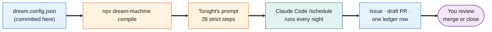
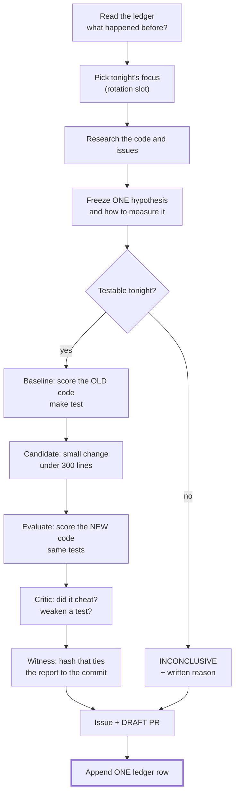
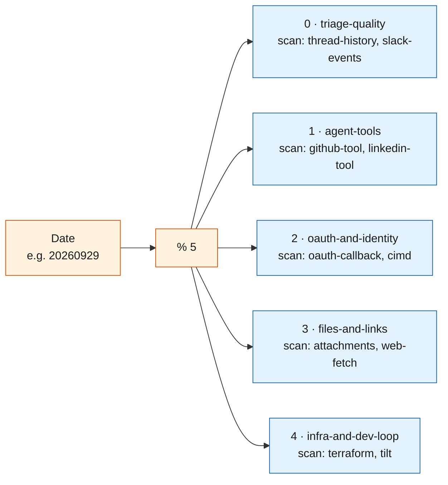
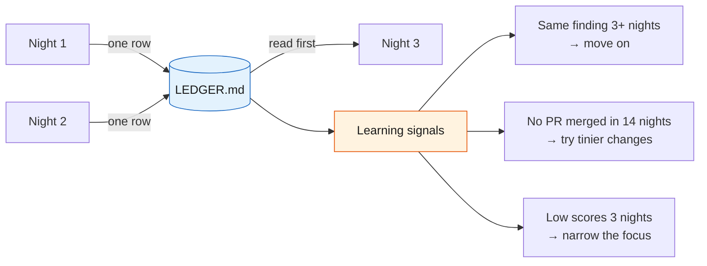
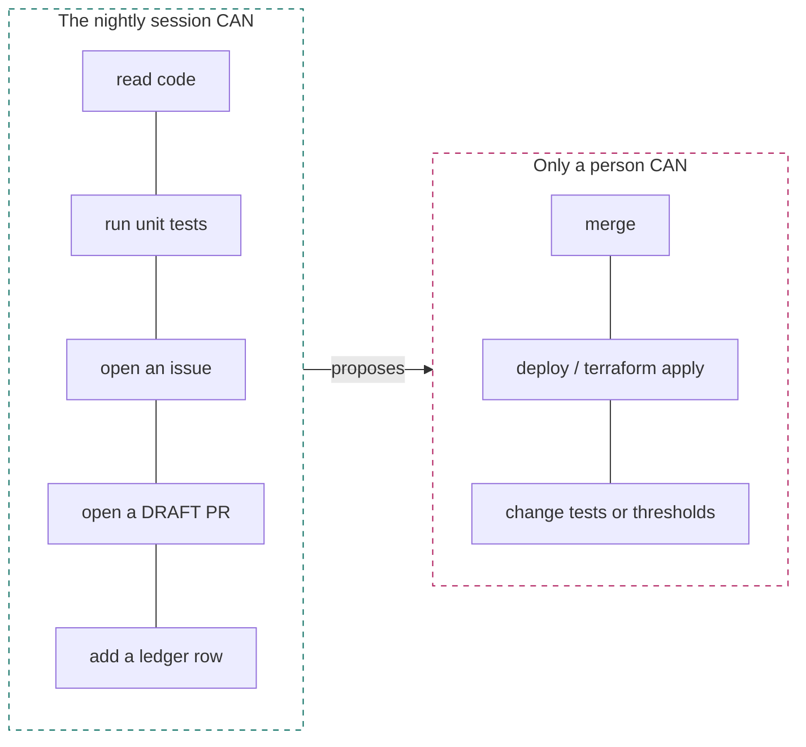
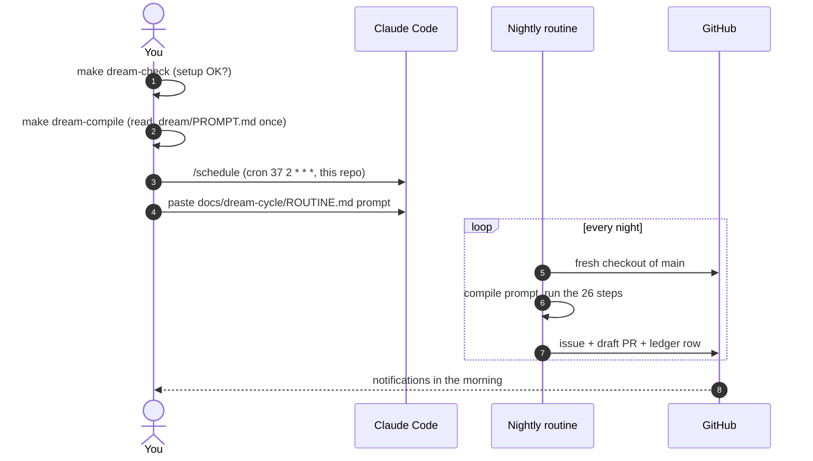

# Dream Machine (nightly self-improvement)

[Dream Machine](https://github.com/ruvnet/dream-machine) runs one small, honest experiment on this repo every night. A Claude Code cloud session picks one idea, measures it with our real tests, and writes down what it learned. It only ever opens **draft** PRs. A person decides what to merge.

This page explains it in plain words and shows what is set up in this repo.

| Section | |
|---|---|
| [1. The idea](#1-the-idea) | What it is, in one picture |
| [2. One night, step by step](#2-one-night-step-by-step) | The pipeline and the three verdicts |
| [3. What is in this repo](#3-what-is-in-this-repo) | The files and commands we added |
| [4. Safety rules](#4-safety-rules) | What it may and may never do |
| [5. Turn it on](#5-turn-it-on) | Create the nightly routine |
| [6. Read the results](#6-read-the-results) | Issues, draft PRs and the ledger |
| [7. Learn by doing](#7-learn-by-doing) | Small exercises to try |
| [8. Glossary](#8-glossary) | Words used on this page |

---

## 1. The idea

Think of a scientist with a lab notebook. Each night they read the notebook, pick one idea, test it, and write the result down. A failed test is still useful, because tomorrow they won't try it again.



Key points:

1. **It is not a new model.** It uses a normal Claude Code cloud session.
2. **The config is the source of truth.** Dream Machine turns our small config into a long, strict prompt. We never edit that prompt by hand.
3. **The repo is the memory.** The cloud session is thrown away every night. What it learned lives in `docs/dream-cycle/LEDGER.md`.
4. **It proposes, people decide.** Draft PRs only. No merges, no deploys.

---

## 2. One night, step by step



Every night ends with **exactly one** verdict:

| Verdict | Meaning | Good night? |
|---|---|---|
| `ACCEPT` | Measured, and it is better. A draft PR is ready. | Yes |
| `REJECT` | Measured, and it is not better. | Yes, we learned something |
| `INCONCLUSIVE` | Could not measure tonight. The reason is written down. | Yes, if the reason is honest |

The goal is to **make tomorrow's search smaller**, not to make many PRs.

### Rotation: a different focus each night

The date picks the slot: `SLOT = YYYYMMDD % 5`. Each slot has one **deep** area (studied carefully) and two **scan** areas (a quick look). `make dream-check` prints tonight's slot.



| Slot | Code it looks at |
|---|---|
| triage-quality | `triage.py` and `thread_history.py` in `backends/lambdas/src/slack_app/`, the agent's `thread_prompt.py`, `test_triage.py` |
| agent-tools | `github.py`, `linkedin.py`, `slack_progress.py` in `backends/agents/slack_agent/src/` |
| oauth-and-identity | the `oauth-callback` Lambda, `cimd/`, `auth_state.py` |
| files-and-links | `attachments.py`, `slack_files.py`, `web_fetch.py` |
| infra-and-dev-loop | `infra-as-code/`, `Tiltfile`, `docs/` |

**Bonus days:** when `YYYYMMDD % 25 == 0` it also checks **docs-accuracy**; when `% 75 == 0` it also checks **per-user-token-isolation**.

### How it remembers



The ledger has 10 columns: `Date | Deep | Finding | Issue | PR | Evaluated? | Verdict | Effect | Witness | Prior-night fates`. "Prior-night fates" records what happened to older PRs, so **your merges and closes teach it** what this team values.

---

## 3. What is in this repo

```
dream.config.json            The per-repo settings (slots, tests, rules)
docs/dream-cycle/
├── LEDGER.md                The memory: one row per night (starts empty)
└── ROUTINE.md               The prompt to paste into /schedule
scripts/dream_check.py       Offline checker: config + ledger + tonight's slot
scripts/tests/               Tests for the checker (run by make test)
```

| Command | What it does | Needs |
|---|---|---|
| `make dream-check` | Checks the config and ledger, prints tonight's focus | Python only |
| `make dream-compile` | Writes the full nightly prompt to `.dream/PROMPT.md` (git-ignored) | Node/npm |
| `make dream-ledger` | Verifies the ledger and prints its learning signals | Node/npm |
| `make test` | Our unit tests. This is the nightly **scoreboard** | Python + uv |

### The config, field by field

| Field | Our value | Meaning |
|---|---|---|
| `repo` | `agent-runtime-labs/slack-agentcore-app` | The target repo |
| `cron` | `37 2 * * *` | 02:37 UTC nightly (an odd minute avoids the busy top of the hour) |
| `slots` | 5 areas | The rotation above |
| `bonusModuli` | 25, 75 | Extra focus on some days |
| `controlPlaneProbes` | `uv`, `terraform`, `make dream-check`, `make test` | What the session checks is available before it starts |
| `buildStep` | install `uv` if missing | Makes `make test` work in a fresh container |
| `evaluatorEntrypoints` | `make test`, `make dream-check`, `terraform fmt -check` | How a change is scored |
| `extraDisciplines` | no AWS, no real Slack, keep per-user tokens isolated | Rules added on top of Dream Machine's own |
| `autoMerge` | `false` | A person always merges. `make dream-check` fails if this changes |

---

## 4. Safety rules



1. **Evaluation is not promotion.** Measuring a change is not shipping it.
2. **Never merge, force-push or publish.**
3. **Never weaken a test** or change expected answers to get a better score.
4. **Never fake a number.** If something can't be measured, say so and end `INCONCLUSIVE`.
5. **This repo's own rules:** no AWS calls, no `terraform apply`, no posts to a real Slack workspace, never weaken [per-user token isolation](identity-and-security.md).
6. **Witness every claim.** `WITNESS = sha256( sha256(report) + commit )`. Anyone can recompute it, so a report can't be quietly edited later.

Keep AWS credentials and Slack tokens **out** of the cloud environment the routine runs in. The unit tests mock AWS and Slack, so nothing is lost.

---

## 5. Turn it on



1. Run `make dream-check`. It should print `Dream Machine setup OK`.
2. Run `make dream-compile` and read `.dream/PROMPT.md`. This is exactly what the session will be told. Reading it once is the best way to learn how it works.
3. Make sure the Claude Code cloud environment can run `make test`. It needs Python and `uv`; the routine installs `uv` if it is missing.
4. In Claude Code, run `/schedule`, choose this repo, cron `37 2 * * *` (or `37 2 * * 1-5` for weeknights only), and paste the prompt from [ROUTINE.md](dream-cycle/ROUTINE.md).
5. Create two GitHub labels if they don't exist: `dream-cycle` and `research`.

To pause it, disable the routine. To stop it for good, delete the routine; the ledger stays as a record.

---

## 6. Read the results

Each morning after a run you will find:

| Where | What to look for |
|---|---|
| GitHub issue `[Dream Cycle <date>] <deep>: <finding>` | The hypothesis, the before/after numbers, the critic's notes, and the verdict |
| Draft PR on a `dream/` branch | The actual change. Review it like any PR |
| New row in `docs/dream-cycle/LEDGER.md` | One-line summary. Check the **Effect** column for real numbers |

Your part:

- **Merge** a good `ACCEPT` PR, or **close** it with a short reason. Both teach the next nights.
- A pile of open drafts is a signal to review, not to ignore. Dream Machine's own repo collected about 30 unmerged drafts, and its ledger then told it to try smaller changes.
- Give changes to OAuth, CIMD or token storage an extra-careful human review, even when the verdict is `ACCEPT`.

---

## 7. Learn by doing

Small exercises, in order:

1. Run `uv run --no-project --python 3.13 python scripts/dream_check.py --date 2026-10-25`. Both bonus surfaces appear, because 20261025 divides by 25 and by 75. Try `--date 2026-09-25` to see only one.
2. Run `make dream-compile`, open `.dream/PROMPT.md`, and find `STEP 0` (the slot maths) and the promotion gate (the list of checks that must all pass for `ACCEPT`).
3. Change one slot name in `dream.config.json`, recompile, and diff the prompt. Only that name changes. That is the "config in, prompt out" idea.
4. Set `"autoMerge": true` and run `make dream-check`. It fails. Put it back.
5. Add a fake ledger row with the verdict `MAYBE` and run `make dream-check`. It fails. Remove it.

A useful next step after the trial: add a small **benchmark**, such as 30 saved Slack threads with the correct triage action (reply, react, correct or ignore). `make test` only says pass or fail; a benchmark gives a real score like "26/30 → 28/30", which lets the machine say a change is *better*, not just *not broken*.

---

## 8. Glossary

| Word | Meaning |
|---|---|
| Night / cycle | One run of the routine |
| Slot | Tonight's focus area, picked from the date |
| Hypothesis | One guess that can be proven wrong, written down before testing |
| Baseline | The score before the change |
| Candidate | The code change being tested |
| Critic | A second check that looks for cheating or weakened tests |
| Darwin | Optional: try a few variations of a change and keep the best |
| Verdict | `ACCEPT`, `REJECT` or `INCONCLUSIVE` |
| Ledger | `docs/dream-cycle/LEDGER.md`, the memory across nights |
| Witness | A hash that ties a report to one commit |
| `LLM_EVAL=blocked` | The night had no model API key, so model-based checks were skipped. Honest, not a failure |

Upstream docs: [README](https://github.com/ruvnet/dream-machine#readme) · [ADR-0001](https://github.com/ruvnet/dream-machine/blob/main/docs/adrs/ADR-0001-dream-machine-engine.md) · [website](https://ruvnet.github.io/dream-machine/)
