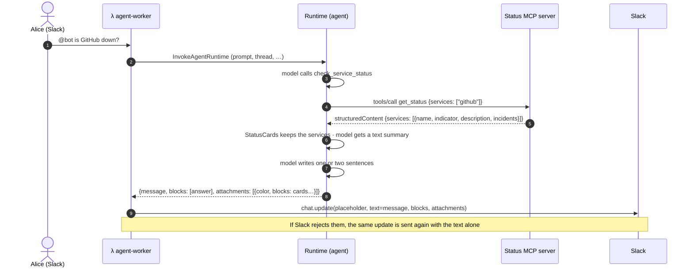

# Service Status Cards (public MCP server → Block Kit)

Ask the bot *"is GitHub down?"* and it answers in a sentence, followed by Slack Block Kit cards with a coloured bar and a dot per service. Only services with a problem get a full card; healthy ones are a compact grid:

```
GitHub has a major outage; Cloudflare and Discord look fine.

▌🚦 Service status · 1 of 3 need attention          (bar: orange)
▌🟠 GitHub — Major outage                           [Status page]
▌Git Operations degraded
▌⚠️ Delayed webhook delivery · investigating
▌🟢 Cloudflare       🟢 Discord
▌Live from each provider's public status page · updated 10:42
```

When everything is healthy it is two lines and a green bar:

```
▌🚦 Service status · all 3 operational
▌GitHub · Cloudflare · Discord
```

The data comes from a **public MCP server** that reads providers' status pages. This guide uses **StatusPulse**, a small MCP server with one tool, `get_status`, that checks a list of providers (GitHub, Cloudflare, Discord and more). Any server that exposes the same tool and result shape works (see [the contract](#the-server-contract)).

It is the first tool that needs **no sign-in**, so it follows none of the OAuth paths in [identity-and-security.md](identity-and-security.md): no consent link, no token vault, no per-user state.

## How it works



Three design points:

1. **A direct call, not a nested agent.** The `cimd/` and GitHub tools wrap a sub-agent because those servers have dozens of tools. This server has one, so [`status_mcp.py`](../backends/agents/slack_agent/src/status_mcp.py) calls `get_status` itself. It is cheaper, faster and deterministic: the cards show exactly what the server returned, not what a model made of it.
2. **The model never writes the cards.** [`status_cards.py`](../backends/agents/slack_agent/src/status_cards.py) builds them from the structured result. The model only supplies the short verdict, and is told not to repeat the per-service lines.
3. **`blocks` and `attachments` are optional fields in the agent's response**, next to `message`. Any future tool can use the same path: put what it wants drawn on a per-request holder (like `AuthState` and `StatusCards`), and `main.py` attaches the Block Kit. `message` is always set too, because it is Slack's notification text and the thread history the next question reads.

## What the cards look like

The model's answer is the message's own `blocks` (one section). The cards sit in one **attachment**, because an attachment is the only way Slack draws a coloured bar down the side.

| Piece | Block | Notes |
|---|---|---|
| The model's answer | `section` (message) | Capped at 3000 characters. If the model wrote nothing, a plain list of the services stands in, so the text never appears twice. |
| Title and headline | `section` | `🚦 *Service status* · 2 of 10 need attention`. When all are healthy, the names follow on a second line and nothing else is drawn. |
| A card per problem | `section` | `🟡 *Cloudflare* — Minor issues` and the provider's own description underneath, with a **Status page** link button when the server gave a URL. Up to 10; the rest are counted (`…and 2 more with issues`). |
| Incidents | `context` | Up to 3 per service: `⚠️ name · _status_`, then `_+N more_` if the server reported more. |
| Healthy services | `section` with `fields` | Two columns, `🟢 GitHub`. Up to 20 names; the rest are counted. |
| Footer | `context` | `<!date^…>` so each person sees the time in their own zone. |

A **single service** (a question about one provider) is always shown as a full card, healthy or not.

The bar colour follows the worst service: green when all are operational, amber for minor or unknown, orange for major, red for critical.

Problems are **sorted worst first**, so one is never below the fold. Services are sorted *before* any cap is applied, so a failing service late in a long list is still shown. Indicators map as follows:

| Indicator | Dot | Label |
|---|---|---|
| `none` | 🟢 | Operational |
| `minor` | 🟡 | Minor issues |
| `major` | 🟠 | Major outage |
| `critical` | 🔴 | Critical outage |
| anything else, or missing | ⚪ | Status unknown (sorted with the problems) |

The worst case (10 problems with incidents plus a full grid) is about 27 blocks, well under Slack's limit of 50. To preview or tweak the layout, paste the `blocks` of the attachment from the agent's log into [Block Kit Builder](https://app.slack.com/block-kit-builder).

## Set it up

### 1. Run (or deploy) the status server

Follow the status server's own README, which ends with a server answering at `https://<host>/mcp`. The agent must be able to reach that URL:

| Where the agent runs | What to use |
|---|---|
| Under Tilt (a container on your machine) | An https tunnel, for example `ngrok http 8787`, and the `https://<sub>.ngrok-free.app/mcp` URL. |
| AgentCore Runtime in AWS | Any public https URL. The runtime uses `network_mode = "PUBLIC"` ([agentcore-runtime/main.tf](../infra-as-code/tf-modules/aws/agentcore-runtime/main.tf)). Host the server somewhere stable: a tunnel URL changes whenever it restarts. |

Check it before involving Slack:

```bash
npx @modelcontextprotocol/inspector@latest      # Streamable HTTP → https://<host>/mcp → Tools → get_status → Run
```

### 2. Local (Tilt)

```bash
# .env
STATUSPULSE_MCP_URL=https://<sub>.ngrok-free.app/mcp
```

```bash
set -a; source .env; set +a
make up
python scripts/send_test_event.py --text "Is GitHub down right now?"
```

With `SLACK_DRY_RUN=true` the reply shows up in the `slack-app` logs in Tilt as a `chat.update` call; look for the `blocks` argument. With a real Slack app connected ([slack-setup.md](slack-setup.md)), mention the bot in a channel and the cards appear in Slack. Restart Tilt after changing `.env`.

### 3. AWS

Set the URL in `infra-as-code/tf-vars/<env>/app-infra-params.tfvars`:

```hcl
statuspulse_mcp_url = "https://status.example.com/mcp"
```

Then `make deploy`. The value must be empty or an `https://` URL (Terraform checks it) and becomes the agent's `STATUSPULSE_MCP_URL`. No new IAM permission, secret or Slack scope is needed: `chat:write` already covers `chat.update` with blocks.

### 4. Try it

| Ask | Expect |
|---|---|
| "Is GitHub down?" | One sentence, then a card for GitHub only. |
| "Check all services" | Full cards for the ones with problems, a grid for the rest, a bar coloured by the worst. |
| "Is Cloudflare or Discord having incidents?" | Two cards. |
| "What is my GitHub username?" | The GitHub tool, not this one: this tool is for public status only. |

## Configuration

| Setting | Where | Default | Effect |
|---|---|---|---|
| `STATUSPULSE_MCP_URL` | `.env` (Tilt), `statuspulse_mcp_url` (Terraform) | empty | Streamable-HTTP URL of the status server. Empty removes the tool **and** its line from the system prompt. |

Tuning that is not a setting but a constant: timeouts in [`status_mcp.py`](../backends/agents/slack_agent/src/status_mcp.py) (`STARTUP_TIMEOUT_SECONDS`, `READ_TIMEOUT_SECONDS`) and display limits in [`status_cards.py`](../backends/agents/slack_agent/src/status_cards.py) (`MAX_SERVICES`, `MAX_INCIDENTS`, `MAX_TEXT_CHARS`).

## The server contract

The tool calls a server tool named `get_status`, with an optional `services` argument (a list of ids), and reads `structuredContent`:

```json
{
  "services": [
    {
      "id": "github",
      "name": "GitHub",
      "indicator": "none | minor | major | critical",
      "description": "All Systems Operational",
      "incidents": [{ "name": "Delayed webhooks", "impact": "minor", "status": "investigating" }],
      "url": "https://www.githubstatus.com",
      "updatedAt": "2026-10-03T05:12:00Z"
    }
  ]
}
```

Only `name` is required; the rest degrades gracefully (a missing indicator shows ⚪). `url` is the provider's public status page: when it is a plain `https://` link the card gets a **Status page** button, otherwise no button is drawn. For a Statuspage-based provider it is the `page.url` of its `summary.json`. To add a service, add it **in the status server**, not here: the cards and the tool are generic, and the model is told to pass the ids the user names, so it needs no list of them. Refresh the server's tool list if it caches one.

## Security

- **Status pages are third-party text.** Incident names and descriptions can say anything. In the cards they are escaped (`&`, `<`, `>`) so a name like `<!channel>` or a spoofed link shows as literal text and can't ping or link, collapsed to one line, and truncated. The indicator is matched against a fixed list, and a button is only made for a plain `https://` URL. The text the model sees is wrapped with an instruction to treat it as data, and the system prompt repeats it. Because the model may still copy an incident name into its answer, the `<!` that starts `<!channel>`, `<!here>` and `<!everyone>` is neutralised in the answer and in the notification text too.
- **No credentials, no user data.** The server is public and the tool sends nothing about the Slack user, so there is no per-user token to isolate. Don't point `STATUSPULSE_MCP_URL` at a server that expects the user's identity; use a `cimd/` provider for that.
- **The URL is operator configuration**, set in Terraform or `.env`, never taken from a message, so users cannot make the agent call arbitrary addresses through this tool. (`fetch_url` is different: it takes user links and has its own SSRF guards.)
- **Failure is quiet.** If the server is down, the tool returns `ERROR: could not reach the status service right now` and the model says so in a line. There are no cards, because nothing was verified.

## Troubleshooting

See [Service status cards](troubleshooting.md#service-status-cards). Quick checks, in order:

1. `STATUSPULSE_MCP_URL` is set where the agent runs: Tilt's `app-config`, or the runtime's environment in AWS.
2. The URL ends in `/mcp` and opens in MCP Inspector from a machine outside your network.
3. The agent log has a line `Invoking agent …` followed by a tool call named `check_service_status`. If the model never calls it, the question didn't look like a public status check: ask more directly, or sharpen the tool docstring in `status_mcp.py`.

## Tests

```bash
make test
```

| File | Covers |
|---|---|
| `tests/test_status_cards.py` | Parsing, sort-before-cap, problem cards vs grid, button and bar colour, block limits, escaping of untrusted text, the per-request holder. |
| `tests/test_status_mcp.py` | What the tool asks the server, what it keeps, and every failure path, with the MCP client faked. |
| `tests/test_main.py` | The tool and prompt rule appear only when configured; `blocks`, `attachments` and a non-empty `message` come back; broadcasts are defanged. |
| `lambdas/tests/test_agent_worker.py` | Blocks and attachments reach `chat.update`; unusable ones are dropped; a Slack rejection falls back to text. |

## Ideas, not built

- A **Refresh** button on the cards. Slack buttons that call back need an Interactivity Request URL and a signed handler on the API Gateway, which this app doesn't have yet (link buttons need neither).
- Reusing the `blocks` and `attachments` fields for other tools, such as a Linear issue list. Add a holder and a builder next to `status_cards.py`; the worker needs no change.
