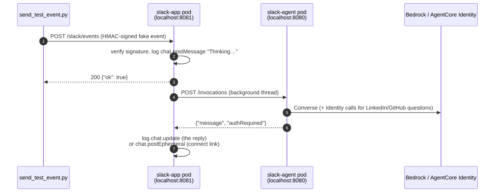

# Testing Guide

How to check that each part of the app works, from unit tests up to a real Slack workspace. Each test lists its steps, what you should see, and what it proves.

| Level | Needs | Covers |
|---|---|---|
| [1. Unit tests](#1-unit-tests) | uv | Signature checks, event filtering, OAuth session binding, the LinkedIn and GitHub tools |
| [2. Agent only](#2-agent-only) | Tilt running | Agent container + Bedrock (Nova Micro) |
| [3. Chat through the Slack handlers (dry run)](#3-chat-through-the-slack-handlers-dry-run) | Tilt | The full request path, without a Slack workspace |
| [4. LinkedIn connect flow (dry run)](#4-linkedin-connect-flow-dry-run) | Tilt + LinkedIn app + identity setup | Per-user OAuth, session binding, token isolation |
| [4b. GitHub connect flow (dry run)](#4b-github-connect-flow-dry-run) | Tilt + GitHub app + identity setup | Same as level 4, second provider |
| [5. Security checks](#5-negative--security-checks) | Level 4 | That bad requests are rejected |
| [6. Real Slack, locally](#6-real-slack-locally) | Slack dev app + ngrok | Slack UI, ephemeral messages |
| [7. Deployed to AWS](#7-deployed-to-aws) | `terraform apply` | Lambdas, SQS, DynamoDB, Runtime with `runtimeUserId` |

## How a test message flows



With `SLACK_DRY_RUN=true`, nothing is sent to Slack. **Every reply shows up as a `[slack dry-run]` line in the `slack-app` logs.** Watch them in the Tilt UI (<http://localhost:10350> → `slack-app`), or run:

```bash
tilt logs slack-app -f | grep --line-buffered "dry-run"
```

## Setup for every session

```bash
cd slack-agentcore-app
make up                       # or: tilt up (skip if it's already running)
set -a; source .env; set +a   # the test script needs SLACK_SIGNING_SECRET
```

Check that both pods are ready:

```bash
kubectl -n slack-agentcore get pods        # slack-agent and slack-app both 1/1 Running
curl -s localhost:8080/ping                 # {"status":"Healthy",...}
curl -s localhost:8081/healthz              # {"status":"ok"}
```

---

## 1. Unit tests

```bash
make test
```

**Expected:** `28 passed` (lambdas) and `11 passed` (agent). Tilt also runs these as the **unit-tests** resource whenever you change the source.

| File | What it checks |
|---|---|
| [test_slack_events.py](../backends/lambdas/tests/test_slack_events.py) | Bad or stale signatures, the URL challenge, mention and DM handling, ignoring bots, edits and retries |
| [test_agent_worker.py](../backends/lambdas/tests/test_agent_worker.py) | Reply replaces the placeholder; a connect link goes only to the requester; agent errors are reported to the user |
| [test_oauth_callback.py](../backends/lambdas/tests/test_oauth_callback.py) | Cookie + redirect; mismatched sessions, missing cookies and replays are rejected |
| [test_identity.py](../backends/lambdas/tests/test_identity.py) | User and session IDs are per user and per workspace |
| [test_linkedin_tool.py](../backends/agents/slack_agent/tests/test_linkedin_tool.py) | Token found, consent needed, revoked token, local workload token fallback |
| [test_github_tool.py](../backends/agents/slack_agent/tests/test_github_tool.py) | Same cases as the LinkedIn tool, against `api.github.com/user` |

---

## 2. Agent only

Call the agent container directly, bypassing Slack and the Lambda code. Use [backends/requests.http](../backends/requests.http), or curl:

```bash
SID=manual-test-session-000000000000000001
curl -s localhost:8080/invocations \
  -H 'Content-Type: application/json' \
  -H "X-Amzn-Bedrock-AgentCore-Runtime-Session-Id: $SID" \
  -d "{\"prompt\":\"What is 12 times 7?\",\"userId\":\"slack-T1-U1\",\"sessionId\":\"$SID\"}"
```

**Expected:**

```json
{"message": "12 times 7 is **84**.", "authRequired": null}
```

The `slack-agent` log shows `Invoking agent for session manual-t with 0 prior messages`. Send a second request with the same `SID` and the count goes up to `2`, which shows history is kept.

---

## 3. Chat through the Slack handlers (dry run)

### 3a. Single question

```bash
uv run --no-project python scripts/send_test_event.py --text "Hello, what can you do?"
```

**Expected output from the script:**

```
200 {"ok": true}
thread_ts=1789570779.304544  (pass --thread-ts to continue this conversation)
```

**Expected `slack-app` logs**, in order:

```
[slack dry-run] chat.postMessage {'channel': 'CLOCALDEV1', 'thread_ts': '…', 'text': '🤔 Thinking…'}
Queued event Ev… from user ULOCALDEV1
[slack dry-run] chat.update {'channel': 'CLOCALDEV1', 'ts': '…', 'text': '<the agent reply>'}
```

This proves: the signature check passes, the placeholder is posted, the job is queued, the agent is invoked, and the placeholder is replaced with the reply.

The Tilt button **send-test-mention** does the same thing with the text "What is my LinkedIn name?".

### 3b. Follow-up in the same thread

```bash
T=<thread_ts printed above>
uv run --no-project python scripts/send_test_event.py --thread-ts $T --text "My favourite colour is teal."
uv run --no-project python scripts/send_test_event.py --thread-ts $T --text "What is my favourite colour?"
```

**Expected:** the last `chat.update` mentions **teal**.

### 3c. Separate history for each person

```bash
uv run --no-project python scripts/send_test_event.py --thread-ts $T --user UOTHERPERSON --text "What is my favourite colour?"
```

**Expected:** the reply does **not** know the colour. Each person in a thread gets their own session (`sha256(team|channel|thread|user)`).

### 3d. Direct message

```bash
uv run --no-project python scripts/send_test_event.py --dm --text "Hi there"
```

**Expected:** the same log pattern as 3a. The event is a `message` with `channel_type: im` instead of an `app_mention`.

---

## 4. LinkedIn connect flow (dry run)

### One-time setup

1. Create the LinkedIn app and put its client ID and secret in `.env` ([linkedin-setup.md](linkedin-setup.md)).
2. Create the identity resources:
   ```bash
   set -a; source .env; set +a
   make identity         # copy the printed redirect URL into LinkedIn → Auth → Authorized redirect URLs
   make local-workload   # allows http://localhost:8081/oauth2/callback as a return URL
   ```
3. Confirm both exist:
   ```bash
   ./infra-as-code/scripts/identity-setup.sh show
   ```

### 4a. First question: consent needed

```bash
uv run --no-project python scripts/send_test_event.py --user UALICE --text "What is my LinkedIn name?"
```

**Expected `slack-app` logs:**

```
[slack dry-run] chat.postEphemeral {'channel': 'CLOCALDEV1', 'user': 'UALICE', …
    'url': 'http://localhost:8081/oauth2/start?nonce=AbC…', …}
[slack dry-run] chat.update {… 'text': '🔐 <@UALICE> I need access to your LinkedIn account first. …'}
```

Check that:
- the connect link is sent with `chat.postEphemeral` to `UALICE` only;
- the raw `linkedin.com` authorization URL does **not** appear in any Slack message.

### 4b. Give consent

1. Copy the `http://localhost:8081/oauth2/start?nonce=…` URL into your browser.
2. You're redirected to LinkedIn. Sign in and click **Allow**.
3. The browser goes LinkedIn → AgentCore Identity → `http://localhost:8081/oauth2/callback?session_id=…`.

**Expected:**
- The browser page says **"LinkedIn connected ✅"**.
- The `slack-app` log shows `chat.postEphemeral {… 'text': '✅ LinkedIn connected. Ask me your question again.'}`.

What happened: the callback found the nonce cookie, confirmed the `session_id` matched the stored session, deleted the nonce, and called `CompleteResourceTokenAuth` with `userId=slack-TLOCALDEV1-UALICE`.

**Complete the consent within 10 minutes and don't change Lambda code in the meantime.** Locally, the pending link lives in the `slack-app` pod's memory, and a code change restarts that pod.

### 4c. Ask again: token is used

```bash
uv run --no-project python scripts/send_test_event.py --user UALICE --text "What is my LinkedIn name?"
```

**Expected:** `chat.update` with your real LinkedIn name and no new connect link.

### 4d. A different user doesn't get Alice's token

```bash
uv run --no-project python scripts/send_test_event.py --user UBOB --text "What is my LinkedIn name?"
```

**Expected:** a **new** `chat.postEphemeral` connect link for `UBOB`. The tokens are stored per user (`slack-TLOCALDEV1-UALICE` and `slack-TLOCALDEV1-UBOB`).

The same applies to a different workspace: `--team TOTHER --user UALICE` is also a separate user.

### 4e. Revoked token

1. On LinkedIn, go to **Settings → Data privacy → Permitted services** and remove your app.
2. Repeat 4c.

**Expected:** LinkedIn returns 401, the tool asks for consent again (`forceAuthentication=True`), and you get a new connect link.

---

## 4b. GitHub connect flow (dry run)

Same flow as level 4, second independent provider. Steps 4a–4e all apply, with these substitutions:

| LinkedIn (level 4) | GitHub (level 4b) |
|---|---|
| `LINKEDIN_CLIENT_ID` / `LINKEDIN_CLIENT_SECRET` ([linkedin-setup.md](linkedin-setup.md)) | `GITHUB_CLIENT_ID` / `GITHUB_CLIENT_SECRET` ([github-setup.md](github-setup.md)) |
| `make identity` | `make identity-github` |
| "What is my LinkedIn name?" | "What is my GitHub username?" |
| `get_my_linkedin_profile` tool, provider `slack-agent-linkedin` | `get_my_github_profile` tool, provider `slack-agent-github` |
| "Connect LinkedIn" button / "LinkedIn connected ✅" | "Connect GitHub" button / "GitHub connected ✅" |
| Revoke at LinkedIn → Settings → Data privacy → Permitted services | Revoke at GitHub → Settings → Applications → Authorized OAuth Apps |

`make local-workload` and the allow-listed return URL are shared — no separate setup needed there (see [github-setup.md](github-setup.md#4-allow-list-your-apps-return-url)).

A good check that the two providers are properly isolated: ask both LinkedIn and GitHub questions in the same thread as the same user. Each triggers its own consent link (different `nonce`, different `provider` in the pending record), and connecting one doesn't connect the other.

---

## 5. Negative / security checks

Run these after 4a, so a pending link exists.

| # | Action | Expected |
|---|---|---|
| 5a | Open a `/oauth2/start` link a second time, after completing consent | **"Link expired"** (400): links work once |
| 5b | `curl -i "localhost:8081/oauth2/start?nonce=made-up"` | 400 "Link expired" |
| 5c | `curl -i "localhost:8081/oauth2/callback?session_id=anything"` (no cookie) | 400 "Sign-in not recognised" |
| 5d | `curl -i -b "slack_agent_oauth=<real nonce>" "localhost:8081/oauth2/callback?session_id=wrong"` | 403, and the nonce is still valid (not consumed) |
| 5e | Wait more than 10 minutes, then open the link | "Link expired" |
| 5f | Send an event with the wrong secret: `SLACK_SIGNING_SECRET=wrong uv run --no-project python scripts/send_test_event.py` | `401 {"error": "invalid signature"}`, nothing queued |
| 5g | Replay a request that's more than 5 minutes old | 401 (covered by the unit test `test_rejects_stale_timestamp`) |
| 5h | Bot or edited messages (`bot_id`, `subtype`) | Ignored (unit test `test_ignores_non_user_events`) |

For 5d, get the real nonce from the `nonce=` value in the 4a log line.

---

## 6. Real Slack, locally

Setup: [slack-setup.md](slack-setup.md). Create a **dev** Slack app, set `SLACK_DRY_RUN=false`, the bot token and the signing secret in `.env`, restart Tilt, start **ngrok-tunnel**, and set the Request URL to `https://<ngrok-host>/slack/events`.

| # | In Slack | Expected |
|---|---|---|
| 6a | Save the Request URL | **Verified ✓** (signed `url_verification`) |
| 6b | `/invite @AgentCore Assistant` in a test channel, then `@AgentCore Assistant hello` | "🤔 Thinking…" in a thread, replaced by the answer |
| 6c | Reply in that thread, mentioning the bot | The answer uses earlier context |
| 6d | DM the bot | Answer in the DM |
| 6e | `@AgentCore Assistant what's my LinkedIn name?` | A public "🔐 I need access…" message **and** a private "Connect LinkedIn" button only you can see ("Only visible to you") |
| 6f | Click the button, consent, then ask again | "LinkedIn connected ✅" in the browser and in Slack; then your name |
| 6g | Ask a teammate to try 6e | They get their own button; they never see your data |
| 6h | Edit a message you sent to the bot | No new reply (edits are ignored) |
| 6i | `@AgentCore Assistant what's my GitHub username?` (needs `make identity-github`, [github-setup.md](github-setup.md)) | Same as 6e/6f, with "Connect GitHub" / "GitHub connected ✅" |

The ngrok inspector at <http://localhost:4040> shows every request Slack sent and how the app responded. It's useful when a message doesn't get a reply.

---

## 7. Deployed to AWS

Setup: [deployment.md](deployment.md). Use a **separate** Slack app pointed at the `slack_events_url` output.

Repeat tests 6a–6i in that Slack app, then check the AWS side:

```bash
cd infra-as-code
PREFIX=slack-agentcore-dev

# Each Lambda
aws logs tail /aws/lambda/$PREFIX-slack-events  --since 10m
aws logs tail /aws/lambda/$PREFIX-agent-worker  --since 10m
aws logs tail /aws/lambda/$PREFIX-oauth-callback --since 10m

# Agent (the runtime ID is the last part of the ARN)
RUNTIME_ID=$(./tf-wrapper.sh dev output -raw agent_runtime_arn | awk -F/ '{print $NF}')
aws logs tail /aws/bedrock-agentcore/runtimes/$RUNTIME_ID-DEFAULT --since 10m

# Nothing stuck in the dead-letter queue
aws sqs get-queue-attributes --attribute-names ApproximateNumberOfMessages \
  --queue-url "$(./tf-wrapper.sh dev output -raw processing_dlq_url)"

# Pending connect links (should be empty soon after consent)
aws dynamodb scan --table-name $PREFIX-pending-oauth --select COUNT
```

**AWS-only checks:**

| # | Check | Expected |
|---|---|---|
| 7a | The runtime log for a LinkedIn or GitHub question | No `No workload access token` error. The Runtime got the token for the user from `runtimeUserId`, with no local fallback. |
| 7b | Callback URL | `https://<api>.execute-api.<region>.amazonaws.com/oauth2/callback`, and the cookie has the `Secure` flag |
| 7c | Invoke the runtime directly **without** `runtimeUserId` (AWS CLI) and ask about LinkedIn or GitHub | No profile data is returned (the tool reports an error): a token can't be used without a user identity |
| 7d | API throttling: send a burst of more than 40 requests per second to `/slack/events` | Some get `429` |
| 7e | DLQ after the tests | `0` |

---

## Test data reference

| Script flag | Default | Becomes |
|---|---|---|
| `--team` | `TLOCALDEV1` | Workspace part of the user ID |
| `--user` | `ULOCALDEV1` | `runtimeUserId = slack-<team>-<user>` (token vault key) |
| `--channel` | `CLOCALDEV1` | Slack channel in the logs |
| `--thread-ts` | new timestamp | Continues an existing conversation |
| `--dm` | off | Sends a `message.im` event instead of `app_mention` |
| `--url` | `http://localhost:8081/slack/events` | Only localhost is accepted |

If something doesn't match what's described here, see [troubleshooting.md](troubleshooting.md).
